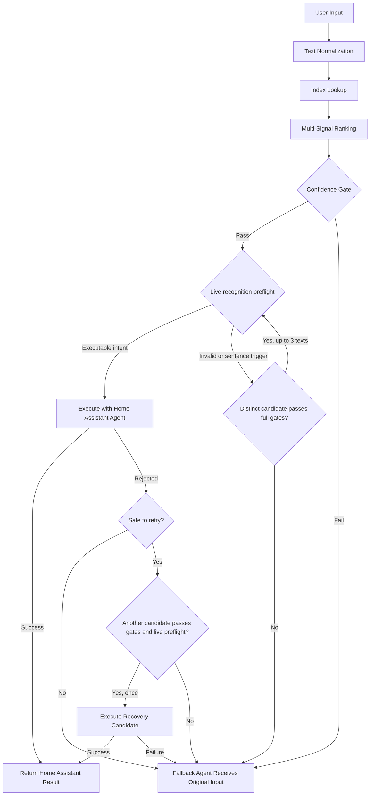

# Assist Canonicalizer for Home Assistant

[](https://github.com/luuquangvu/assist-canonicalizer/releases)
[](https://github.com/hacs/integration)
[](https://www.home-assistant.io)

[](https://github.com/luuquangvu/assist-canonicalizer/actions/workflows/ci.yaml)
[](https://github.com/luuquangvu/assist-canonicalizer/actions/workflows/validation.yaml)
[](https://github.com/luuquangvu/assist-canonicalizer/actions/workflows/github-code-scanning/codeql)
[](https://github.com/luuquangvu/assist-canonicalizer/actions/workflows/prettier.yaml)

**[ 🇺🇸 English | [🇻🇳 Tiếng Việt](README.vi.md) ]**

**Assist Canonicalizer** improves intent recognition in Home Assistant Assist by mapping natural-language requests to canonical intent sentences before they reach the built-in conversation agent. It runs as a Home Assistant conversation agent and uses local, multi-signal lexical ranking for canonicalization, without requiring an LLM or an external service.

---

## Table of Contents

- [Assist Canonicalizer for Home Assistant](#assist-canonicalizer-for-home-assistant)
  - [Table of Contents](#table-of-contents)
  - [Features](#features)
  - [Installation](#installation)
    - [Option 1: Using HACS (Recommended)](#option-1-using-hacs-recommended)
    - [Option 2: Manual Installation](#option-2-manual-installation)
  - [Setup & Configuration](#setup--configuration)
  - [How It Works](#how-it-works)
  - [Benchmark Performance](#benchmark-performance)
  - [Developer Tools Actions](#developer-tools-actions)
    - [Test Match](#test-match)
    - [Rebuild Index](#rebuild-index)
    - [Clear Index](#clear-index)
    - [Diagnostics](#diagnostics)
    - [Dump Candidates](#dump-candidates)
  - [Confidence Gates & Fallback](#confidence-gates--fallback)
  - [Troubleshooting & Debugging](#troubleshooting--debugging)
    - [Common Issues](#common-issues)
    - [Diagnostic Workflow](#diagnostic-workflow)
  - [Requirements](#requirements)
  - [Code Quality & Security](#code-quality--security)
  - [Contributing](#contributing)
  - [License](#license)
  - [Support the Project](#support-the-project)

---

## Features

- **Home Assistant Conversation Agent**: Integrates directly with Assist as a conversation agent. It canonicalizes incoming requests and sends the selected command through Home Assistant's standard conversation flow.
- **Multi-Signal Lexical Ranking Engine**: Scores every candidate against your input using four complementary signals: **RapidFuzz fuzzy matching**, **character n-gram Jaccard similarity**, **BM25 probabilistic retrieval**, and **intent domain action matching**. The weighted ensemble consistently outperforms single-signal approaches.
- **Automatic Candidate Index Building**: Builds its canonical candidate index from every available source: built-in Home Assistant intents, your custom sentence YAML files, exposed entity names and aliases, area and floor registry entries, and dynamically expanded slot values. No manual configuration required.
- **On-Disk Candidate Persistence**: Saves canonicalized candidate lists to Home Assistant's storage layer so that intent source parsing can be skipped on subsequent rebuilds. Indexes are rebuilt from saved candidates, eliminating the need to re-parse sentence templates and YAML files.
- **Configurable Confidence Gates**: Fine-tune match acceptance with **Minimum Match Confidence** and **Base Confidence Margin** thresholds. Exact lexical matches and other strong-evidence policies can reduce the required margin; if no earlier relaxation applies, competing actions, including known opposing actions, must clear the full configured margin.
- **Live Recognition Preflight & Bounded Recovery**: Verifies if a matched sentence is executable using Home Assistant's native intent parser before triggering any action. The engine tests up to three high-confidence candidates before falling back, and retains a one-time recovery attempt if a command is rejected before the handler runs.
- **Rich Developer Tools**: Five dedicated actions (`test_match`, `rebuild_index`, `clear_index`, `diagnostics`, `dump_candidates`) give you full visibility into the ranking process, live index inspection, and manual control over index lifecycle, all from the standard Developer Tools Actions panel.
- **Per-Language Isolation**: Maintains a dedicated candidate index for each language, with automatic language variant matching against Home Assistant's supported language list. Slot values are dynamically expanded per language.
- **Scalable Performance & Memory Safety**: Implements strict candidate limits per intent and ranking pass to prevent memory bloat, combined with sparse query-time registry lookups. This keeps the index small and fast while ensuring dynamic entity names and aliases remain fully searchable.
- **Local Canonicalization**: Normalization, indexing, ranking, and recovery checks run inside your Home Assistant instance. The integration itself sends no telemetry and makes no cloud requests; any external processing depends on the fallback agent you configure.

---

## Installation

### Option 1: Using HACS (Recommended)

[](https://my.home-assistant.io/redirect/hacs_repository/?owner=luuquangvu&repository=assist-canonicalizer&category=integration)

1. Open **HACS** in Home Assistant.
2. Search for **Assist Canonicalizer**.
3. If not found, click the three dots in the top right corner and select **Custom repositories**.
4. Add `https://github.com/luuquangvu/assist-canonicalizer` with category **Integration**.
5. Search for **Assist Canonicalizer** and click **Download**.
6. Restart Home Assistant.

### Option 2: Manual Installation

1. Download the latest release and extract the files.
2. Copy the `custom_components/assist_canonicalizer` folder into your Home Assistant `config/custom_components/` directory.
3. Restart Home Assistant.

---

## Setup & Configuration

1. Go to **Settings** > **Devices & Services**.
2. Click **Add Integration** and search for **Assist Canonicalizer**.
3. Select the **Fallback Conversation Agent**. When the canonicalizer cannot safely complete a request, it sends the original text to this agent for a second chance. For the best chance of recovery, choose an agent that interprets language differently, such as an LLM-based conversation agent. The built-in Home Assistant agent is also supported, but it may encounter the same limitation that led to fallback.
4. Set the **Minimum Match Confidence**. A candidate must score at or above this threshold across all four ranking signals to be accepted. Stick with the default value initially and use the **Test Match** action to observe real scores before making adjustments.
5. Set the **Base Confidence Margin**. This defines the normal required gap in scores between the top match and the next best alternative (with a different intent), preventing execution when a command is ambiguous. Exact lexical matches and other strong-evidence policies can reduce or bypass this requirement before action competition is evaluated. If no earlier relaxation applies, competing actions, including known opposing actions such as turn on vs. turn off, must clear the full configured value.
6. Go to **Settings** > **Voice assistants** and open your Assist pipeline. Under **Conversation agents**, select **Assist Canonicalizer** from the agent list.

> [!IMPORTANT]
> **Without completing the above steps, Assist Canonicalizer will not process any commands.** The integration only activates when it is part of the active Assist pipeline.
>
> Start with the default threshold values and adjust based on your experience. If the canonicalizer falls back too often, try lowering `min_confidence`. If it produces mismatched intents, raise `min_confidence` and `min_margin`.

---

## How It Works

When you speak a command (via speech-to-text) or type in the Assist chat box, Assist Canonicalizer receives the request and processes it through the following pipeline:



1. **Text Normalization**: The input is NFKC-normalized, casefolded, punctuation-stripped, and whitespace-collapsed into a canonical token sequence. This normalization is language-agnostic and applied identically to both input text and candidate sentences, ensuring fair comparison.

2. **Index Lookup**: The normalized query is matched against a pre-built candidate index for the active language. The index contains candidates sourced from:
   - **Built-in Intents**: Every fixed sentence and bounded template expansion from Home Assistant's sentence configuration for the language.
   - **Custom Sentences**: Sentences defined in `custom_sentences/<lang>/` YAML files, `configuration.yaml` intent scripts, or sentence automations created via the UI.
   - **Registry Entities**: Exposed entity names and aliases from the entity registry.
   - **Areas & Floors**: Area and floor names from the area and floor registries.

3. **Multi-Signal Ranking**: Each candidate is scored through four independent signals, then combined into a weighted final score:
   - **Word Similarity**: Measures how closely the words and their order match, handles typos, reordered words, and partial matches.
   - **Character Pattern Matching**: Compares overlapping 3-letter chunks between your input and each candidate, catching spelling variations and similar-looking words.
   - **Keyword Relevance**: Weighs how important each word is across all candidates, giving more credit to distinctive words that appear in your input.
   - **Intent Context**: Rewards candidates whose intent type (e.g., turning on a light, setting a temperature) aligns with the top matches, preventing nonsensical pairings.

4. **Confidence Gate**: Evaluates the top candidate against your configured thresholds:
   - **Confidence Floor**: The candidate's final score must clear the `min_confidence` threshold.
   - **Dynamic Margin**: The candidate normally must lead its next best meaningful competitor (representing a different intent) by the configured `min_margin`. Exact lexical matches can bypass that margin, and other strong-evidence policies can reduce it before action competition is evaluated. If none of those earlier policies applies, competing actions, including known opposing pairs such as turn on/off, open/close, and lock/unlock, must clear the full configured margin. Gating decisions and effective margins are fully visible via diagnostics.

5. **Live Preflight, Execution, and Bounded Recovery**: Once a candidate passes the confidence gate, it undergoes a multi-stage validation and execution process:
   - **Live Recognition Preflight**: The candidate text is dry-run through Home Assistant's native intent recognition to verify it is executable. If it is invalid (e.g., references a non-existent area or device), the candidate is discarded, and the engine re-evaluates the remaining list (testing up to three distinct alternatives). If none are valid, it falls back to the configured fallback agent.
   - **Live Execution**: If the preflight check succeeds, the command is sent to Home Assistant's built-in conversation agent (HassIL) for execution.
   - **Bounded Post-Execution Recovery**: If execution is rejected before the intent handler begins processing (returning `no_intent_match`, or `no_valid_targets` due to unmatched entities), the integration can attempt a one-time recovery. It filters out duplicate commands and tries the next best candidate that still meets the confidence criteria. Errors occurring inside the intent handler itself do not trigger recovery and will result in fallback.

6. **Fallback**: If ranking does not produce a safe candidate, recovery is not eligible, or execution fails, the integration forwards the original input to your configured fallback conversation agent.

---

## Benchmark Performance

To ensure real-world reliability, the integration is benchmarked end-to-end within a managed Home Assistant instance using all real-world test cases across five languages (DE, EN, FR, NL, VI). Every query is executed as a live pair: first directly through the default Assist pipeline (HassIL), and then through Assist Canonicalizer. Both attempts are evaluated against executable controls to measure exact intent, slot, and target resolution accuracy.

### Overall Results

<!-- BENCHMARK_OVERALL_START -->

> Benchmark dependency versions: `Python` 3.14.6, `homeassistant` 2026.7.3, `hassil` 3.8.0, `home-assistant-intents` 2026.6.24.

| Mode           | Canonicalizer | Direct HassIL | Uplift pp | Recovered | Regressed | Mismatch | Fallback | P50 ms | P95 ms |
| :------------- | ------------: | ------------: | --------: | --------: | --------: | -------: | -------: | -----: | -----: |
| `managed_live` |     **88.8%** |         47.9% |     +40.9 |       250 |         5 |     1.3% |     9.8% |  117.9 |  377.4 |

<!-- BENCHMARK_OVERALL_END -->

> Each of the test queries is run side-by-side: directly through the built-in Assist pipeline and Assist Canonicalizer. This direct comparison measures the real-world accuracy improvement (uplift), successful recoveries, and regressions.

### Per-Language Breakdown

<!-- BENCHMARK_LANGS_START -->

| Language | Canonicalizer | Direct HassIL | Uplift pp | Recovered | Regressed | Mismatch | Fallback | P50 ms | P95 ms |
| :------- | ------------: | ------------: | --------: | --------: | --------: | -------: | -------: | -----: | -----: |
| EN       |     **91.5%** |         52.7% |     +38.8 |        51 |         1 |     0.0% |     8.5% |   79.9 |  426.0 |
| DE       |     **90.2%** |         48.4% |     +41.8 |        52 |         1 |     0.8% |     9.0% |  176.1 |  371.9 |
| FR       |     **89.1%** |         50.4% |     +38.7 |        47 |         1 |     2.5% |     8.4% |  123.1 |  421.6 |
| NL       |     **87.6%** |         48.8% |     +38.8 |        51 |         1 |     0.8% |    11.6% |  103.4 |  332.2 |
| VI       |     **85.0%** |         37.0% |     +48.0 |        49 |         1 |     3.0% |    12.0% |  104.2 |  241.3 |

<!-- BENCHMARK_LANGS_END -->

> [!NOTE]
> In this benchmark, we assume that about half the time our intents work with the default HassIL. The actual results may differ depending on your usage habits.
>
> Accuracy results are deterministic for the tracked 3-floor, 12-area, 60-exposed-entity fixture. Latency is hardware-sensitive, so performance changes should be verified with before/after managed-live reports on the same host.
>
> Detailed benchmark run reports and raw JSON data are generated under the `scratch/` directory and are not committed to the repository. This prevents massive file diffs on pull requests, which would otherwise introduce significant noise during peer and AI code reviews.

To reproduce the benchmark from [`tests/real_world/`](tests/real_world/), run:

```bash
uv run tools/benchmark.py
```

For detailed information on the benchmark fixture, baseline comparisons, and reporting contracts, see [`tools/ha_dev/README.md`](tools/ha_dev/README.md). Note that `tools/benchmark_offline.py` is reserved strictly for offline diagnostics and micro-profiling, and should not be used as production accuracy evidence.

Supported languages are verified across two tiers:

- **Accuracy-Gated**: German, English, French, Dutch, and Vietnamese are backed by fully maintained managed-live test corpora.
- **Compatibility Smoke-Tested**: All other language variants provided by `home-assistant-intents` are validated automatically. These tests ensure the index loads correctly, parses without errors, and runs stable traces on production execution paths, though they do not guarantee semantic accuracy.

---

## Developer Tools Actions

All actions are accessible from **Developer Tools** > **Actions** in Home Assistant.

### Test Match

**Action**: `assist_canonicalizer.test_match`

Tests the canonicalization pipeline against a text input and returns the full ranking output. Useful for tuning confidence thresholds and understanding why a particular input matched or fell back.

| Field      | Required | Description                              |
| ---------- | -------- | ---------------------------------------- |
| `text`     | Yes      | The input text to canonicalize and match |
| `language` | No       | Language code (auto-detected if omitted) |

**Response includes**:

- `normalized_text`: The normalized form of your input
- `top_candidates`: Ranked list of candidates with nested `scores` keys (`rapidfuzz`, `char_ngram`, `bm25`, `intent`, `penalty`, `final`)
- `selected_candidate`: The top candidate and its intent name
- `accepted`: Whether the top candidate passed the confidence gates

### Rebuild Index

**Action**: `assist_canonicalizer.rebuild_index`

Manually triggers a full rebuild of the canonical candidate index for one language. Rebuilds are automatically deduplicated: if another rebuild for the same language is already in progress, this call awaits the existing task.

| Field      | Required | Description                  |
| ---------- | -------- | ---------------------------- |
| `language` | No       | Language code to rebuild for |

### Clear Index

**Action**: `assist_canonicalizer.clear_index`

Clears the cached index for a specific language, or every cached index if no language is specified. Also removes persisted index data from Home Assistant storage.

| Field      | Required | Description            |
| ---------- | -------- | ---------------------- |
| `language` | No       | Language code to clear |

### Diagnostics

**Action**: `assist_canonicalizer.diagnostics`

Returns a real-time snapshot of the integration's runtime state, including:

- `candidate_count`: Number of candidates in the active index
- `index_version`: Generation version of the current index
- `last_query_latency_ms`: Processing time of the most recent query
- `last_fallback_reason`: Why the last query fell back (if applicable)
- `last_error`: The last error encountered (if any)
- `dynamic_candidate_count`: Number of dynamically generated registry candidates
- `cached_languages`: Language codes with cached indexes currently in memory
- `cached_candidate_counts`: Candidate count per cached language
- `pending_rebuild_languages`: Languages with an index rebuild currently in progress
- `registry_slot_counts`: Number of values available per registry slot (entity names, area names, etc.)
- `dynamic_candidate_generation`: Status and limits for dynamic candidate expansion
- `subscribed_intent_source_counts`: Intent counts per subscribed conversation agent source

### Dump Candidates

**Action**: `assist_canonicalizer.dump_candidates`

Returns detailed candidate source information for a language, including source counts, intent counts, registry slot counts, and sample candidates. Useful for debugging why a particular sentence is or isn't being matched.

| Field      | Required | Description                                                             |
| ---------- | -------- | ----------------------------------------------------------------------- |
| `language` | No       | Language code to inspect                                                |
| `rebuild`  | No       | If `true`, builds the candidate cache before dumping (default: `false`) |

---

## Confidence Gates & Fallback

The integration uses two configurable thresholds to decide whether to accept a top-ranked candidate:

**Minimum Match Confidence** (`min_confidence`)
: The weighted final score of the best candidate must be at or above this value. Scores range from 0.0 (no match) to 1.0 (perfect match across all four signals).

**Base Confidence Margin** (`min_margin`)
: The normal minimum lead over the next meaningful competitor. Exact lexical, high-confidence, and other safe-evidence policies are evaluated first and may reduce or bypass this margin even when action competition is present. If no earlier relaxation applies, competing actions, including known opposing actions, must clear the full configured margin. Diagnostics and **Test Match** expose the effective policy; candidate metadata alone is not an execution guarantee because live recognition is performed only on the production conversation path.

When a query **falls back**, the reason is recorded in diagnostics as one of:

| Reason                 | Meaning                                                                                                  |
| ---------------------- | -------------------------------------------------------------------------------------------------------- |
| `low_confidence`       | No candidate met the `min_confidence` threshold                                                          |
| `low_margin`           | The top candidate and the next candidate with a different intent scored too closely (below `min_margin`) |
| `empty_index`          | No index exists for the active language                                                                  |
| `validation_failed`    | Candidate failed the preflight check, or both primary execution and recovery failed                      |
| `ranking_failed`       | An unexpected error occurred during the ranking phase                                                    |
| `unexpected_exception` | An unrecoverable error occurred during processing                                                        |

You can inspect the fallback reason for the last query using the **Diagnostics** action.

---

## Troubleshooting & Debugging

### Common Issues

**The canonicalizer always falls back and never matches.**

1. Run the **Diagnostics** action and check `last_fallback_reason`. If it's `empty_index`, the index hasn't been built yet. Indexes are proactively warmed up at startup/reload for all configured Assist pipeline languages. If `empty_index` still appears, the warmup may have been skipped (no pipelines configured, no default language available), or the background build hasn't completed yet. You can force a rebuild with the **Rebuild Index** action.
2. If the reason is `low_confidence`, your `min_confidence` threshold may be too high. Try lowering it in the integration options. Use **Test Match** with sample sentences to see actual scores.
3. If the reason is `validation_failed`, the selected command failed the live preflight check, or both execution and recovery attempts failed. Use **Test Match** to analyze scoring, and **Dump Candidates** to inspect the registered commands for your language.

**My custom sentences aren't being recognized.**

1. Verify your custom sentences are configured correctly: they can be in `config/custom_sentences/<lang>/` YAML files, `configuration.yaml` intent scripts, or sentence automations created via the UI. Ensure they use the correct language code.
2. Run **Dump Candidates** with `rebuild: true` for your language. Check the `source` counts: if `custom_sentence` is zero, your files may not be loading.
3. Ensure your YAML files follow the [Home Assistant sentence syntax](https://www.home-assistant.io/voice_control/custom_sentences/).
4. Force a rebuild with **Rebuild Index** after making changes to your sentence files.

**The integration appears slow on the first query.**

Indexes for configured Assist pipeline languages are built proactively in the background at startup and after reloads. Under normal conditions, the first query for a language should hit an already-warm cache and experience no cold-start delay.

If a delay does occur, the index may not have finished building yet (check `pending_rebuild_languages` in the **Diagnostics** output). Languages outside your pipeline configuration are built lazily on first use. Subsequent queries use the cached in-memory index and are much faster.

**I changed my entities/areas/floors but the canonicalizer doesn't reflect them.**

The integration subscribes to entity, area, floor, and exposed entity registry change events and rebuilds its index automatically after a 5-second debounce. If the change doesn't appear to be reflected immediately, wait a few seconds for the debounced rebuild to complete. Run **Rebuild Index** to force an immediate scan without waiting.

### Diagnostic Workflow

For systematic debugging, follow this sequence:

1. **Check runtime state**: Run **Diagnostics** to see candidate count, index version, last query latency, and fallback reason.
2. **Inspect the index**: Run **Dump Candidates** with `rebuild: true` for your language to see all candidate sources, intent coverage, and sample candidates.
3. **Test a specific input**: Run **Test Match** with the exact sentence that's failing. Examine each `top_candidates` entry's `scores` object (`rapidfuzz`, `char_ngram`, `bm25`, `intent`, `penalty`, `final`) and the top-level `score` to understand why the top candidate did or didn't pass the confidence gate.
4. **Compare with fallback**: If the canonicalizer falls back, use **Test Match** to see how the canonicalizer scored the sentence versus what the fallback agent returned. If Test Match shows a strong candidate that was just below the confidence thresholds, lowering thresholds may help. If the fallback agent also returned a poor result, the sentence may need better coverage in your intent sources.
5. **Adjust thresholds**: Based on the score breakdowns, adjust `min_confidence` and `min_margin` in the integration options. Use **Test Match** to verify the new thresholds work as expected.
6. **Check logs**: Home Assistant logs may contain additional details. Look for messages from the `assist_canonicalizer` domain.

## Requirements

- **Home Assistant** `>= 2024.12.0`
- The integration requires the `conversation` domain and depends on `assist_pipeline` being available. It works with any conversation agent that Home Assistant supports.

---

## Code Quality & Security

To ensure long-term reliability and stability, this project utilizes a modern stack of automated development and security tools:

- **Automated Code Review**: [CodeRabbit AI](https://coderabbit.ai) provides deep analysis of every Pull Request, identifying potential logic flaws and edge cases before they reach your system.
- **Code Optimization**: [Sourcery AI](https://sourcery.ai) suggests cleaner, more idiomatic Python patterns to maintain a high-quality codebase.
- **Static Analysis & Security**: [CodeQL](https://codeql.github.com) performs industry-standard scans to detect security vulnerabilities and ensure compliance with best practices.
- **Rigorous Development Workflow**:
  - **[Ruff](https://github.com/astral-sh/ruff)**: High-performance linting and formatting for consistent Python code.
  - **[Ty](https://github.com/astral-sh/ty)** & **[Pyright](https://github.com/Microsoft/pyright)**: Dual-layer type checking to catch type errors before runtime and ensure API stability.
  - **[Pytest](https://github.com/pytest-dev/pytest)**: A comprehensive test suite ensuring every update is functional and regression-free.
  - **[Interrogate](https://github.com/econchick/interrogate)**: Docstring coverage enforcement across the entire codebase to keep the code self-documenting.
  - **[Prettier](https://github.com/prettier/prettier)**: Consistent formatting for documentation and configuration files.

> [!NOTE]
> All automated insights are manually reviewed and validated by the project maintainer to ensure every change aligns with the project's standards.

---

## Contributing

Contributions are what make the open-source community such an amazing place to learn, inspire, and create. Any contributions you make are **greatly appreciated**.

> [!IMPORTANT]
> The development environment for this project is **Linux**. If you are using Windows, please use [WSL (Windows Subsystem for Linux)](https://learn.microsoft.com/en-us/windows/wsl/install), as the test suite and development tools are designed to run in a Linux environment.
>
> Project dependencies and execution are managed via `uv`.

- **If you find a bug**, please help us improve by [opening an issue](https://github.com/luuquangvu/assist-canonicalizer/issues).
- **If you'd like to contribute**, feel free to fork the repo and create a Pull Request (please ensure your code passes the [quality checks](#code-quality--security) mentioned above).

---

## License

Distributed under the **MIT License**. See [LICENSE](LICENSE) for more information.

## Support the Project

If you find this project helpful, your support is truly appreciated and serves as a great motivation to keep improving it. Thank you! ❤️

[](https://www.paypal.me/luuquangvu89)
