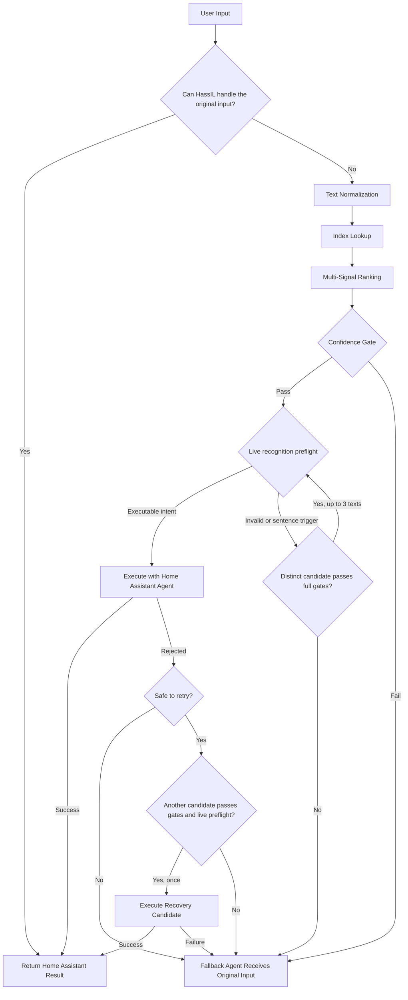

# Assist Canonicalizer for Home Assistant

[](https://github.com/luuquangvu/assist-canonicalizer/releases)
[](https://github.com/hacs/integration)
[](https://www.home-assistant.io)

[](https://github.com/luuquangvu/assist-canonicalizer/actions/workflows/ci.yaml)
[](https://github.com/luuquangvu/assist-canonicalizer/actions/workflows/validation.yaml)
[](https://github.com/luuquangvu/assist-canonicalizer/actions/workflows/github-code-scanning/codeql)
[](https://github.com/luuquangvu/assist-canonicalizer/actions/workflows/prettier.yaml)

**🇺🇸 English | [🇻🇳 Tiếng Việt](README.vi.md)**

**Assist Canonicalizer** improves intent recognition in Home Assistant Assist by mapping natural-language requests to canonical intent sentences before they reach the built-in conversation agent. It runs as a Home Assistant conversation agent and uses local, multi-signal lexical ranking for canonicalization, without requiring an LLM or an external service.

People do not always phrase the same request in the same way. Word order, filler words, aliases, and speech-to-text errors can all affect recognition. Assist Canonicalizer handles these variations while leaving final intent recognition and execution to Home Assistant.

---

## Table of Contents

- [Assist Canonicalizer for Home Assistant](#assist-canonicalizer-for-home-assistant)
  - [Table of Contents](#table-of-contents)
  - [Features](#features)
  - [Installation](#installation)
    - [Option 1: Using HACS (Recommended)](#option-1-using-hacs-recommended)
    - [Option 2: Manual Installation](#option-2-manual-installation)
  - [Setup and Configuration](#setup-and-configuration)
  - [How It Works](#how-it-works)
  - [Benchmark Results](#benchmark-results)
  - [Developer Tools Actions](#developer-tools-actions)
    - [Set Fallback Agent](#set-fallback-agent)
    - [Test Match](#test-match)
    - [Rebuild Index](#rebuild-index)
    - [Clear Index](#clear-index)
    - [Diagnostics](#diagnostics)
    - [Dump Candidates](#dump-candidates)
  - [Confidence Gates and Fallback](#confidence-gates-and-fallback)
  - [Troubleshooting and Debugging](#troubleshooting-and-debugging)
    - [Common Issues](#common-issues)
    - [Diagnostic Workflow](#diagnostic-workflow)
  - [Requirements](#requirements)
  - [Code Quality and Security](#code-quality-and-security)
  - [Contributing](#contributing)
  - [License](#license)
  - [Support the Project](#support-the-project)

---

## Features

- **Home Assistant Conversation Agent**: Integrates directly with Assist as a conversation agent. It canonicalizes incoming requests and sends the selected command through Home Assistant's standard conversation flow.
- **Multi-Signal Lexical Ranking Engine**: Scores candidates with four complementary signals: **RapidFuzz fuzzy matching**, **character n-gram Jaccard similarity**, **BM25 probabilistic retrieval**, and **intent action matching**. Combining these signals makes the ranking more robust than relying on any one score alone.
- **Automatic Candidate Index Building**: Builds language-specific indexes from supported Home Assistant sources: built-in intents, custom sentence YAML files, exposed entity names and aliases, area and floor registries, and dynamically expanded slot values.
- **On-Disk Candidate Persistence**: Stores canonical candidate lists in Home Assistant storage. Later rebuilds can reuse these lists instead of parsing every sentence template and YAML file again.
- **Configurable Confidence Gates**: Fine-tune match acceptance with **Minimum Match Confidence** and **Base Confidence Margin** thresholds. Exact lexical matches and other strong-evidence policies can reduce the required margin; if no earlier relaxation applies, competing actions, including known opposing actions, must clear the full configured margin.
- **Live Recognition Preflight and Bounded Recovery**: Verifies whether a matched sentence is executable using Home Assistant's native intent parser before triggering an action. The engine tests up to three high-confidence candidates before falling back and allows one recovery attempt if a command is rejected before the handler runs.
- **Developer Tools Actions**: Six actions (`set_fallback_agent`, `test_match`, `rebuild_index`, `clear_index`, `diagnostics`, and `dump_candidates`) provide dynamic fallback routing, ranking details, index summaries, diagnostics, and manual index lifecycle controls from Home Assistant's standard Actions panel.
- **Per-Language Isolation**: Maintains a dedicated candidate index for each language, with automatic language variant matching against Home Assistant's supported language list. Slot values are dynamically expanded per language.
- **Bounded Resource Use**: Applies candidate limits per intent and ranking pass, together with sparse query-time registry lookups. This keeps memory use predictable while retaining dynamic entity names and aliases for matching.
- **Local Canonicalization**: Normalization, indexing, ranking, and recovery checks run inside your Home Assistant instance. The integration itself sends no telemetry and makes no cloud requests; any external processing depends on the fallback agent you configure.

---

## Installation

### Option 1: Using HACS (Recommended)

[](https://my.home-assistant.io/redirect/hacs_repository/?owner=luuquangvu&repository=assist-canonicalizer&category=integration)

1. Open **HACS** in Home Assistant.
2. Search for **Assist Canonicalizer**.
3. If not found, click the three dots in the top right corner and select **Custom repositories**.
4. Add `https://github.com/luuquangvu/assist-canonicalizer` with category **Integration**.
5. Search for **Assist Canonicalizer** and click **Download**.
6. Restart Home Assistant.

### Option 2: Manual Installation

1. Download the latest release and extract the files.
2. Copy the `custom_components/assist_canonicalizer` folder into your Home Assistant `config/custom_components/` directory.
3. Restart Home Assistant.

---

## Setup and Configuration

1. Go to **Settings** > **Devices & Services**.
2. Click **Add Integration** and search for **Assist Canonicalizer**.
3. Select the **Fallback Conversation Agent**. When the canonicalizer cannot safely complete a request, it sends the original text to this agent for a second chance. For the best chance of recovery, choose an agent that interprets language differently, such as an LLM-based conversation agent. The built-in Home Assistant agent is also supported, but it may encounter the same limitation that led to fallback.
4. Set the **Minimum Match Confidence**. A candidate's weighted final score must meet this threshold to be accepted. Start with the default and use **Test Match** to inspect real scores before adjusting it.
5. Set the **Base Confidence Margin**. This defines the normal required gap in scores between the top match and the next best alternative (with a different intent), preventing execution when a command is ambiguous. Exact lexical matches and other strong-evidence policies can reduce or bypass this requirement before action competition is evaluated. If no earlier relaxation applies, competing actions, including known opposing actions such as turn on vs. turn off, must clear the full configured value.
6. Go to **Settings** > **Voice assistants** and open your Assist pipeline. Under **Conversation agents**, select **Assist Canonicalizer** from the agent list.

> [!IMPORTANT]
> **Without completing the above steps, Assist Canonicalizer will not process any commands.** The integration only activates when it is part of the active Assist pipeline.
>
> Start with the default threshold values and adjust based on your experience. If the canonicalizer falls back too often, try lowering `min_confidence`. If it produces mismatched intents, raise `min_confidence` and `min_margin`.

---

## How It Works

Home Assistant gives its built-in HassIL agent the first chance when the Assist pipeline has `prefer_local_intents` enabled. When that option is disabled, Assist Canonicalizer supplies the equivalent HassIL-first shortcut. Canonicalization begins only if HassIL cannot handle the original text:



1. **HassIL First**: With `prefer_local_intents` enabled, Home Assistant tries HassIL before falling back to Assist Canonicalizer. With it disabled, the pipeline delegates directly to Assist Canonicalizer, which sends the unchanged request to HassIL as a shortcut. The integration skips its shortcut when Home Assistant has already performed the local-intent pass. If HassIL succeeds, its result is returned immediately and the remaining steps are skipped.

2. **Text Normalization**: The input is NFKC-normalized, casefolded, stripped of punctuation, and collapsed to a consistent whitespace form. The same process is applied to the input and candidate sentences.

3. **Index Lookup**: The normalized query is matched against a pre-built candidate index for the active language. The index contains candidates sourced from:
   - **Built-in Intents**: Every fixed sentence and bounded template expansion from Home Assistant's sentence configuration for the language.
   - **Custom Sentences**: Sentences defined in `custom_sentences/<lang>/` YAML files, `configuration.yaml` intent scripts, or sentence automations created via the UI.
   - **Registry Entities**: Exposed entity names and aliases from the entity registry.
   - **Areas and Floors**: Area and floor names from the area and floor registries.

4. **Multi-Signal Ranking**: Each candidate is scored through four independent signals, then combined into a weighted final score:
   - **Word Similarity**: Measures how closely the words and their order match, handles typos, reordered words, and partial matches.
   - **Character Pattern Matching**: Compares overlapping 3-letter chunks between your input and each candidate, catching spelling variations and similar-looking words.
   - **Keyword Relevance**: Weighs how important each word is across all candidates, giving more credit to distinctive words that appear in your input.
   - **Intent Context**: Rewards candidates whose intent type (e.g., turning on a light, setting a temperature) aligns with the top matches, preventing nonsensical pairings.

5. **Confidence Gate**: Evaluates the top candidate against your configured thresholds:
   - **Confidence Floor**: The candidate's final score must clear the `min_confidence` threshold.
   - **Dynamic Margin**: The candidate normally must lead its next best meaningful competitor (representing a different intent) by the configured `min_margin`. Exact lexical matches can bypass that margin, and other strong-evidence policies can reduce it before action competition is evaluated. If none of those earlier policies applies, competing actions, including known opposing pairs such as turn on/off, open/close, and lock/unlock, must clear the full configured margin. Gating decisions and effective margins are fully visible via diagnostics.

6. **Live Preflight, Execution, and Bounded Recovery**: Once a candidate passes the confidence gate, it undergoes a multi-stage validation and execution process:
   - **Live Recognition Preflight**: The candidate text is dry-run through Home Assistant's native intent recognition to verify it is executable. If it is invalid (e.g., references a non-existent area or device), the candidate is discarded, and the engine re-evaluates the remaining list (testing up to three distinct alternatives). If none are valid, it falls back to the configured fallback agent.
   - **Live Execution**: If the preflight check succeeds, the command is sent to Home Assistant's built-in conversation agent (HassIL) for execution.
   - **Bounded Post-Execution Recovery**: If execution is rejected before the intent handler begins processing (returning `no_intent_match`, or `no_valid_targets` due to unmatched entities), the integration can attempt a one-time recovery. It filters out duplicate commands and tries the next best candidate that still meets the confidence criteria. Errors occurring inside the intent handler itself do not trigger recovery and will result in fallback.

7. **Fallback**: If ranking does not produce a safe candidate, recovery is not eligible, or execution fails, the integration forwards the original input to your configured fallback conversation agent.

---

## Benchmark Results

The managed-live benchmark runs every query twice against the same Home Assistant fixture: once directly through HassIL and once through Assist Canonicalizer's direct path. To mirror production routing, the reported Assist Canonicalizer result uses the HassIL outcome when it is correct and uses the direct canonicalizer outcome only when HassIL fails. This models both HassIL-first routes: Home Assistant's local-intent pass when `prefer_local_intents` is enabled and Assist Canonicalizer's shortcut when it is disabled. Both runs are evaluated against executable controls for intent, slot, and target resolution.

### Overall Results

<!-- BENCHMARK_OVERALL_START -->

> Benchmark dependency versions: `Python` 3.14.6, `homeassistant` 2026.7.4, `hassil` 3.8.0, `home-assistant-intents` 2026.6.24.

| Mode           | Assist Canonicalizer | Direct HassIL | Uplift pp | Recovered | Regressions prevented | Mismatch | Fallback | P50 ms | P95 ms |
| :------------- | -------------------: | ------------: | --------: | --------: | --------------------: | -------: | -------: | -----: | -----: |
| `managed_live` |            **90.0%** |         47.9% |     +42.1 |       252 |                     5 |     1.2% |     8.8% |   98.6 |  293.4 |

<!-- BENCHMARK_OVERALL_END -->

> Accuracy, mismatch, and fallback are mutually exclusive HassIL-first outcomes and total 100% before rounding. “Regressions prevented” counts queries that HassIL handles correctly even though the direct canonicalizer path does not meet its success criteria. Latency describes the direct canonicalizer benchmark request; explicitly named direct-path outcome metrics remain available in the raw report.

### Per-Language Breakdown

<!-- BENCHMARK_LANGS_START -->

| Language | Assist Canonicalizer | Direct HassIL | Uplift pp | Recovered | Regressions prevented | Mismatch | Fallback | P50 ms | P95 ms |
| :------- | -------------------: | ------------: | --------: | --------: | --------------------: | -------: | -------: | -----: | -----: |
| EN       |            **92.2%** |         52.7% |     +39.5 |        51 |                     1 |     0.0% |     7.8% |   67.2 |  295.0 |
| DE       |            **91.0%** |         48.4% |     +42.6 |        52 |                     1 |     0.8% |     8.2% |  151.9 |  308.7 |
| FR       |            **89.9%** |         50.4% |     +39.5 |        47 |                     1 |     2.5% |     7.6% |   99.6 |  316.1 |
| NL       |            **89.9%** |         48.8% |     +41.1 |        53 |                     1 |     0.8% |     9.3% |   91.7 |  271.7 |
| VI       |            **86.0%** |         37.0% |     +49.0 |        49 |                     1 |     2.0% |    12.0% |   77.0 |  227.5 |

<!-- BENCHMARK_LANGS_END -->

> [!NOTE]
> The corpus deliberately uses a roughly even mix of cases aligned with direct HassIL (exact matches, built-in intent coverage, and supported fillers) and challenge cases that direct HassIL is expected not to recognize (distortions, missing or extra words, spelling mistakes, semantic challenges, and paraphrases). This composition is why the direct HassIL result is around 50% in the tracked benchmark. It is a property of the benchmark design, not the expected success rate for every Home Assistant installation.
>
> Accuracy results are deterministic for the tracked 3-floor, 12-area, 60-exposed-entity fixture. Latency is hardware-sensitive, so performance changes should be verified with before/after managed-live reports on the same host.
>
> Detailed reports and raw JSON data are generated under `scratch/` and are not committed. Keeping generated artifacts out of the repository makes pull requests smaller and easier to review.

To reproduce the benchmark from [`tests/real_world/`](tests/real_world/), run:

```bash
uv sync --all-groups
uv run tools/benchmark.py
```

For details about the managed fixture, baseline comparisons, and report formats, see [`tools/ha_dev/README.md`](tools/ha_dev/README.md). `tools/benchmark_offline.py` is intended for offline diagnostics and focused profiling; it is not production accuracy evidence.

Supported languages are verified across two tiers:

- **Accuracy-Gated**: German, English, French, Dutch, and Vietnamese are evaluated against maintained managed-live test corpora.
- **Compatibility Smoke-Tested**: All other language variants provided by `home-assistant-intents` are checked automatically. These tests verify that indexes load, parse, and complete representative execution traces without errors; they do not measure semantic accuracy.

---

## Developer Tools Actions

All actions are accessible from **Developer Tools** > **Actions** in Home Assistant.

When a request produces an unexpected result, these actions show how it was normalized and ranked, what the index contains, and why the request fell back. This makes it easier to identify where matching went wrong.

### Set Fallback Agent

**Action**: `assist_canonicalizer.set_fallback_agent`

Changes the fallback conversation agent for future requests. The selection is persisted in the integration options and takes effect immediately without reloading the integration, making the action suitable for automations that switch agents based on current conditions.

| Field      | Required | Description                               |
| ---------- | -------- | ----------------------------------------- |
| `agent_id` | Yes      | The conversation agent to use as fallback |

The optional response reports `fallback_agent_id`, `previous_fallback_agent_id`, and `changed`, which is `true` when Home Assistant updated the persisted config entry and `false` when it was already identical.

### Test Match

**Action**: `assist_canonicalizer.test_match`

Runs lexical ranking for a text input and returns detailed scoring and confidence-gate evidence. Use it to inspect a match or tune confidence thresholds. It does not run live Home Assistant intent recognition.

| Field      | Required | Description                                                 |
| ---------- | -------- | ----------------------------------------------------------- |
| `text`     | Yes      | The input text to canonicalize and match                    |
| `language` | No       | Language code (uses the Home Assistant language if omitted) |

**Response includes**:

- `normalized_text`: The normalized form of your input
- `candidate_count`: Number of static candidates in the language index
- `dynamic_candidate_count`: Number of registry-based candidates generated for this request
- `evaluation`: Scope of the test, including that live intent recognition was not run
- `top_candidates`: Ranked candidates with slot data, wildcard replacements, and nested `scores` keys (`rapidfuzz`, `char_ngram`, `bm25`, `intent`, `penalty`, `final`)
- `selected_candidate`: Candidate accepted by the confidence gates, if any
- `accepted`: Whether a candidate passed the confidence gates
- `confidence_gate`: Thresholds, margin policy, competitor evidence, and rejection reason

### Rebuild Index

**Action**: `assist_canonicalizer.rebuild_index`

Manually triggers a full rebuild of the canonical candidate index for one language. Rebuilds are automatically deduplicated: if another rebuild for the same language is already in progress, this call awaits the existing task.

| Field      | Required | Description                  |
| ---------- | -------- | ---------------------------- |
| `language` | No       | Language code to rebuild for |

**Response includes** the normalized `language`, the resulting `candidate_count` for that language, and the time taken in `rebuild_latency_ms`.

### Clear Index

**Action**: `assist_canonicalizer.clear_index`

Clears the cached index for a specific language, or every cached index if no language is specified. Also removes persisted index data from Home Assistant storage.

| Field      | Required | Description            |
| ---------- | -------- | ---------------------- |
| `language` | No       | Language code to clear |

**Response includes** the normalized target `language`, the clear `scope`, the cached languages that were removed, the count of candidates removed, and the cache state that remains.

### Diagnostics

**Action**: `assist_canonicalizer.diagnostics`

Returns a real-time snapshot of the integration's runtime state, including:

- `total_cached_candidate_count`: Total candidates across all cached language indexes
- `cached_indexes`: Candidate count and index version for each cached language
- `last_query_latency_ms`: Processing time of the most recent query
- `last_fallback_reason`: Why the last query fell back (if applicable)
- `last_error`: The last error encountered (if any)
- `dynamic_candidate_count`: Number of registry-based candidates generated for the most recent request
- `pending_rebuild_languages`: Languages with an index rebuild currently in progress
- `registry_slot_counts`: Number of values available per registry slot (entity names, area names, etc.)
- `dynamic_candidate_generation`: Status and limits for dynamic candidate expansion
- `subscribed_intent_source_counts`: Intent counts per subscribed conversation agent source

### Dump Candidates

**Action**: `assist_canonicalizer.dump_candidates`

Returns detailed candidate source information for a language, including source counts, intent counts, registry slot counts, and sample candidates. Useful for debugging why a particular sentence is or isn't being matched.

| Field      | Required | Description                                                          |
| ---------- | -------- | -------------------------------------------------------------------- |
| `language` | No       | Language code to inspect                                             |
| `rebuild`  | No       | If `true`, forces an index rebuild before dumping (default: `false`) |

The response has the same structure for every `index_status`: `missing`, `cached`, or `rebuilt`. It includes rebuild latency, intent and candidate-source counts, registry slot counts, and a limited candidate sample. `candidate_sample.truncated` indicates that additional candidates exist beyond the returned sample.

---

## Confidence Gates and Fallback

The integration uses two configurable thresholds to decide whether to accept a top-ranked candidate:

**Minimum Match Confidence** (`min_confidence`): The weighted final score of the best candidate must be at or above this value. Scores range from 0.0 (no match) to 1.0 (the maximum weighted score).

**Base Confidence Margin** (`min_margin`): The normal minimum lead over the next meaningful competitor. Exact lexical, high-confidence, and other safe-evidence policies are evaluated first and may reduce or bypass this margin even when action competition is present. If no earlier relaxation applies, competing actions, including known opposing actions, must clear the full configured margin. Diagnostics and **Test Match** expose the effective policy; candidate metadata alone does not guarantee execution because live recognition runs only through the normal Assist conversation path.

When a query **falls back**, the reason is recorded in diagnostics as one of:

| Reason                 | Meaning                                                                                                  |
| ---------------------- | -------------------------------------------------------------------------------------------------------- |
| `low_confidence`       | No candidate met the `min_confidence` threshold                                                          |
| `low_margin`           | The top candidate and the next candidate with a different intent scored too closely (below `min_margin`) |
| `empty_index`          | No index exists for the active language                                                                  |
| `validation_failed`    | Candidate failed the preflight check, or both primary execution and recovery failed                      |
| `ranking_failed`       | An unexpected error occurred during the ranking phase                                                    |
| `unexpected_exception` | An unrecoverable error occurred during processing                                                        |

You can inspect the fallback reason for the last query using the **Diagnostics** action.

---

## Troubleshooting and Debugging

Before changing thresholds, check the runtime state and candidate coverage, then inspect the ranking evidence for the exact phrase that failed. This helps avoid improving one command at the expense of another.

### Common Issues

**The canonicalizer always falls back and never matches.**

1. Run the **Diagnostics** action and check `last_fallback_reason`. If it's `empty_index`, the index hasn't been built yet. Indexes are proactively warmed up at startup/reload for all configured Assist pipeline languages. If `empty_index` still appears, the warmup may have been skipped (no pipelines configured, no default language available), or the background build hasn't completed yet. You can force a rebuild with the **Rebuild Index** action.
2. If the reason is `low_confidence`, your `min_confidence` threshold may be too high. Try lowering it in the integration options. Use **Test Match** with sample sentences to see actual scores.
3. If the reason is `validation_failed`, the selected command failed the live preflight check, or both execution and recovery attempts failed. Use **Test Match** to analyze scoring, and **Dump Candidates** to inspect the registered commands for your language.

**My custom sentences aren't being recognized.**

1. Verify your custom sentences are configured correctly: they can be in `config/custom_sentences/<lang>/` YAML files, `configuration.yaml` intent scripts, or sentence automations created via the UI. Ensure they use the correct language code.
2. Run **Dump Candidates** with `rebuild: true` for your language. Check `candidate_source_counts`: if `custom_sentence` is zero or absent, your files may not be loading.
3. Ensure your YAML files follow the [Home Assistant sentence syntax](https://www.home-assistant.io/voice_control/custom_sentences/).
4. Force a rebuild with **Rebuild Index** after making changes to your sentence files.

**The integration appears slow on the first query.**

Indexes for configured Assist pipeline languages are built proactively in the background at startup and after reloads. Under normal conditions, the first query for a language should hit an already-warm cache and experience no cold-start delay.

If a delay does occur, the index may not have finished building yet (check `pending_rebuild_languages` in the **Diagnostics** output). Languages outside your pipeline configuration are built lazily on first use. Subsequent queries use the cached in-memory index and are much faster.

**I changed my entities/areas/floors but the canonicalizer doesn't reflect them.**

The integration subscribes to entity, area, floor, and exposed entity registry change events and rebuilds its index automatically after a 5-second debounce. If the change doesn't appear to be reflected immediately, wait a few seconds for the debounced rebuild to complete. Run **Rebuild Index** to force an immediate scan without waiting.

### Diagnostic Workflow

For systematic debugging, follow this sequence:

1. **Check runtime state**: Run **Diagnostics** and review `cached_indexes`, `last_query_latency_ms`, and `last_fallback_reason`.
2. **Inspect the index**: Run **Dump Candidates** with `rebuild: true` for your language to review source counts, intent coverage, and the bounded candidate sample.
3. **Test a specific input**: Run **Test Match** with the exact sentence that is failing. Review each `top_candidates` entry's `scores` object (`rapidfuzz`, `char_ngram`, `bm25`, `intent`, `penalty`, and `final`) together with `confidence_gate`.
4. **Review fallback behavior**: If the canonicalizer falls back, use **Test Match** to inspect its lexical decision, then review the Assist trace or logs for the fallback agent's result. A strong candidate just below the configured thresholds may justify careful tuning; poor results from both paths usually indicate missing intent coverage.
5. **Adjust thresholds**: Based on the score breakdowns, adjust `min_confidence` and `min_margin` in the integration options. Use **Test Match** to verify the new thresholds work as expected.
6. **Check logs**: Home Assistant logs may contain additional details. Look for messages from the `assist_canonicalizer` domain.

## Requirements

- **Home Assistant** `>= 2024.12.0`
- The integration requires the `conversation` domain and depends on `assist_pipeline` being available. It works with any conversation agent that Home Assistant supports.

---

## Code Quality and Security

Because voice commands can control real devices, changes need more than a successful happy-path test. The project combines automated checks with code review to catch regressions, problems in error handling, and assumptions that no longer match the implementation.

- **Validation Pipeline**: The repository entry point checks dependency alignment, formatting, linting, types, docstring coverage, and behavior:
  - **[Ruff](https://github.com/astral-sh/ruff)**: High-performance linting and formatting for consistent Python code.
  - **[Ty](https://github.com/astral-sh/ty)** and **[Pyright](https://github.com/Microsoft/pyright)**: Complementary static type checks.
  - **[Pytest](https://github.com/pytest-dev/pytest)**: Automated behavior and regression tests.
  - **[Interrogate](https://github.com/econchick/interrogate)**: Docstring coverage enforcement.
  - **[Prettier](https://github.com/prettier/prettier)**: Consistent formatting for documentation and configuration files.
- **Static Analysis and Security**: [CodeQL](https://codeql.github.com) scans the repository for supported vulnerability patterns.
- **Review Assistance**: [CodeRabbit AI](https://coderabbit.ai) and [Sourcery AI](https://sourcery.ai) provide additional review suggestions. Findings are checked against the current code before changes are accepted.

Run the same validation entry point locally before opening a pull request:

```bash
uv run tools/validate.py
```

> [!NOTE]
> Passing checks are useful evidence, but they do not replace understanding the affected code path. Automated findings are treated as review input, and every proposed fix is verified against the current implementation.

---

## Contributing

Contributions of any size are welcome. A reproducible phrase that fails in one language, a clearer explanation, or a focused regression test can be just as useful as a code change.

Particularly helpful contributions include:

- **Actionable bug reports**: Include your Home Assistant and integration versions, language, exact input, expected result, actual result, and relevant diagnostics. Remove private entity names or other household details before sharing.
- **Language coverage**: Share natural expressions, aliases, and edge cases from real use. Updates to multilingual test corpora are especially useful when they include the expected intent, slots, and canonical sentence.
- **Documentation and usability**: Improve setup guidance, troubleshooting, or translations when something was difficult to find or understand.
- **Code and tests**: Keep changes focused, explain the behavior being changed, and add regression coverage where practical.

> [!IMPORTANT]
> The development environment for this project is **Linux**. If you are using Windows, please use [WSL (Windows Subsystem for Linux)](https://learn.microsoft.com/en-us/windows/wsl/install), as the test suite and development tools are designed to run in a Linux environment.
>
> Project dependencies and execution are managed via `uv`.

If you find a bug or want to discuss a behavior change, start by [opening an issue](https://github.com/luuquangvu/assist-canonicalizer/issues). If you want to contribute code, fork the repository, open a focused pull request, and make sure it passes the [quality checks](#code-quality-and-security).

---

## License

Distributed under the **MIT License**. See [LICENSE](LICENSE) for more information.

---

## Support the Project

You can support the project by using the integration, reporting clear edge cases, improving language coverage, or sharing it with other Home Assistant users. Real-world feedback helps uncover needs that test data may miss.

Financial contributions are also appreciated, but entirely optional. Thank you for using and contributing to the project. ❤️

[](https://www.paypal.me/luuquangvu89)
