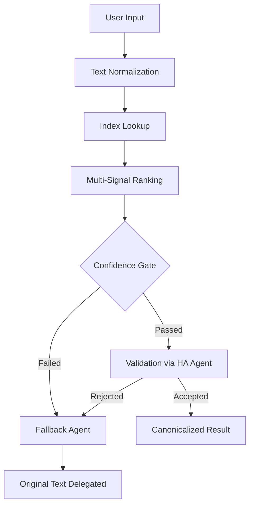

# Assist Canonicalizer for Home Assistant

**[ 🇺🇸 English | [🇻🇳 Tiếng Việt](README.vi.md) ]**

**Assist Canonicalizer** enhances Home Assistant Assist intent accuracy by canonicalizing natural-language commands through a multi-signal lexical ranking engine before they reach the built-in conversation agent. It integrates as a native conversation agent, slashing mismatches and fallback rates while running entirely on your local machine, LLM-free, no cloud, no telemetry, no external calls.

---

## Table of Contents

- [Assist Canonicalizer for Home Assistant](#assist-canonicalizer-for-home-assistant)
  - [Table of Contents](#table-of-contents)
  - [Features](#features)
  - [Installation](#installation)
    - [Option 1: Using HACS (Recommended)](#option-1-using-hacs-recommended)
    - [Option 2: Manual Installation](#option-2-manual-installation)
  - [Setup & Configuration](#setup--configuration)
  - [How It Works](#how-it-works)
  - [Benchmark Performance](#benchmark-performance)
  - [Developer Tools Actions](#developer-tools-actions)
    - [Test Match](#test-match)
    - [Rebuild Index](#rebuild-index)
    - [Clear Index](#clear-index)
    - [Diagnostics](#diagnostics)
    - [Dump Candidates](#dump-candidates)
  - [Confidence Gates & Fallback](#confidence-gates--fallback)
  - [Troubleshooting & Debugging](#troubleshooting--debugging)
    - [Common Issues](#common-issues)
    - [Diagnostic Workflow](#diagnostic-workflow)
  - [Requirements](#requirements)
  - [Code Quality & Security](#code-quality--security)
  - [Contributing](#contributing)
  - [License](#license)
  - [Support the Project](#support-the-project)

---

## Features

- **Native Conversation Agent**: Registers as a fully-fledged Home Assistant conversation agent. Intercepts every Assist command, preprocesses it through lexical canonicalization, and transparently delegates validated results to your existing conversation pipeline.
- **Multi-Signal Lexical Ranking Engine**: Scores every candidate against your input using four complementary signals: **RapidFuzz fuzzy matching**, **character n-gram Jaccard similarity**, **BM25 probabilistic retrieval**, and **intent domain action matching**. The weighted ensemble consistently outperforms single-signal approaches.
- **Automatic Candidate Index Building**: Builds its canonical candidate index from every available source: built-in Home Assistant intents, your custom sentence YAML files, exposed entity names and aliases, area and floor registry entries, and dynamically expanded slot values. No manual configuration required.
- **On-Disk Candidate Persistence**: Saves canonicalized candidate lists to Home Assistant's storage layer so that intent source parsing can be skipped on subsequent rebuilds. Indexes are rebuilt from saved candidates, eliminating the need to re-parse sentence templates and YAML files.
- **Configurable Confidence Gates**: Fine-tune acceptance behavior with **Minimum Match Confidence** and **Minimum Confidence Margin** thresholds. Only candidates that clear both thresholds receive canonicalization.
- **Safe Multi-Stage Fallback**: If the ranking confidence is too low, the margin between the top candidate and the next candidate of a different intent is insufficient, the index is empty, or validation against the built-in agent fails, the system dispatches your original text to a separately configured fallback agent. Selecting an LLM-based agent here is ideal, as it can interpret natural language differently and recover from mismatches that the built-in recognizer cannot handle.
- **Rich Developer Tools**: Five dedicated actions (`test_match`, `rebuild_index`, `clear_index`, `diagnostics`, `dump_candidates`) give you full visibility into the ranking process, live index inspection, and manual control over index lifecycle, all from the standard Developer Tools Actions panel.
- **Per-Language Isolation**: Maintains a dedicated candidate index for each language, with automatic language variant matching against Home Assistant's supported language list. Slot values are dynamically expanded per language.
- **Scalable Candidate Capping**: Built-in safety limits prevent memory exhaustion by automatically capping candidates per language, per intent, per template, and per ranking pass.
- **Local-Only Processing**: Classified as `local_push` IoT class. Every operation: normalization, indexing, ranking, and validation runs entirely within your Home Assistant instance. No cloud dependency, no telemetry, no external calls.

---

## Installation

### Option 1: Using HACS (Recommended)

1. Open **HACS** in Home Assistant.
2. Search for **Assist Canonicalizer**.
3. If not found, click the three dots in the top right corner and select **Custom repositories**.
4. Add `https://github.com/luuquangvu/assist-canonicalizer` with category **Integration**.
5. Search for **Assist Canonicalizer** and click **Download**.
6. Restart Home Assistant.

### Option 2: Manual Installation

1. Download the latest release and extract the files.
2. Copy the `custom_components/assist_canonicalizer` folder into your Home Assistant `config/custom_components/` directory.
3. Restart Home Assistant.

---

## Setup & Configuration

1. Go to **Settings** > **Devices & Services**.
2. Click **Add Integration** and search for **Assist Canonicalizer**.
3. Select the **Fallback Conversation Agent**. When the canonicalizer cannot safely match a candidate, your original text is dispatched to this agent as a second chance. Choosing the built-in Home Assistant agent as the fallback is usually ineffective; the accepted canonicalized candidate was already validated against it and failed, so sending the raw text back to the same agent will likely fail again. For best results, select an LLM-based conversation agent that can interpret natural language differently and recover from the mismatch.
4. Set the **Minimum Match Confidence**. A candidate must score at or above this threshold across all four ranking signals to be accepted. Stick with the default value initially and use the **Test Match** action to observe real scores before making adjustments.
5. Set the **Minimum Confidence Margin**. The gap between the top-ranked candidate and the next candidate with a different intent name must be at least this value. This prevents situations where the input is ambiguous and two different intents score similarly. Use the default value at first; only tighten or relax it after analyzing actual score breakdowns with **Test Match**.
6. Go to **Settings** > **Voice assistants** and open your Assist pipeline. Under **Conversation agents**, select **Assist Canonicalizer** from the agent list. We recommend enabling **Prefer handling commands locally** so that the built-in local intent recognizer (Hassil) is tried first. If it can handle the command directly, it does so without involving the canonicalizer; otherwise, Assist Canonicalizer takes over to match the input against its canonical index.

> [!IMPORTANT]
> **Without completing the above steps, Assist Canonicalizer will not process any commands.** The integration only activates when it is part of the active Assist pipeline.
>
> Start with the default threshold values and adjust based on your experience. If the canonicalizer falls back too often, try lowering `min_confidence`. If it produces mismatched intents, raise `min_confidence` and `min_margin`.

---

## How It Works

When you speak a command (via speech-to-text) or type into the Assist chat box, Assist Canonicalizer intercepts the text and processes it through the following pipeline:

1. **Text Normalization**: The input is NFKC-normalized, casefolded, punctuation-stripped, and whitespace-collapsed into a canonical token sequence. This normalization is language-agnostic and applied identically to both input text and candidate sentences, ensuring fair comparison.

2. **Index Lookup**: The normalized query is matched against a pre-built candidate index for the active language. The index contains candidates sourced from:
   - **Built-in Intents**: Every fixed sentence and bounded template expansion from Home Assistant's sentence configuration for the language.
   - **Custom Sentences**: Sentences defined in `custom_sentences/<lang>/` YAML files, `configuration.yaml` intent scripts, or sentence automations created via the UI.
   - **Registry Entities**: Exposed entity names and aliases from the entity registry.
   - **Areas & Floors**: Area and floor names from the area and floor registries.

3. **Multi-Signal Ranking**: Each candidate is scored through four independent signals, then combined into a weighted final score:
   - **Word Similarity**: Measures how closely the words and their order match, handles typos, reordered words, and partial matches.
   - **Character Pattern Matching**: Compares overlapping 3-letter chunks between your input and each candidate, catching spelling variations and similar-looking words.
   - **Keyword Relevance**: Weighs how important each word is across all candidates, giving more credit to distinctive words that appear in your input.
   - **Intent Context**: Rewards candidates whose intent type (e.g., turning on a light, setting a temperature) aligns with the top matches, preventing nonsensical pairings.

4. **Confidence Gate**: The top-ranked candidate must clear both the configured `min_confidence` and `min_margin` thresholds. If either threshold is not met, the system falls back.

5. **Validation**: The accepted candidate is validated by sending its canonical sentence to the built-in Home Assistant conversation agent (Hassil). If the HA agent successfully processes the canonicalized sentence, the result is returned. Otherwise, the system falls back.

6. **Fallback**: When ranking or validation is not safe, the original user text is forwarded to your configured fallback conversation agent, preserving the standard Assist experience.

---

## Benchmark Performance

The ranking engine was benchmarked against the default Home Assistant Hassil intent recognizer using real-world test datasets across five languages (DE, EN, FR, NL, VI).

### Overall Results

<!-- BENCHMARK_OVERALL_START -->

| Mode      | Intent/Slot | Mismatch |  Fallback |
| --------- | ----------: | -------: | --------: |
| `hassil`  |       29.8% |     9.6% |     60.6% |
| `lexical` |   **80.9%** | **8.3%** | **10.9%** |

> Intent/slot accuracy jumped from **29.8% to 80.9%**. The combined error rate (mismatch + fallback) dropped from **70.2% to 19.1%**.

<!-- BENCHMARK_OVERALL_END -->

### Per-Language Breakdown

<!-- BENCHMARK_LANGS_START -->

| Language | Mode      | Intent/Slot |  Mismatch |  Fallback |
| -------- | --------- | ----------: | --------: | --------: |
| EN       | `hassil`  |       28.8% |     15.3% |     55.9% |
| EN       | `lexical` |   **86.5%** |  **6.3%** |  **7.2%** |
| DE       | `hassil`  |       32.2% |     12.6% |     55.2% |
| DE       | `lexical` |   **88.5%** |  **3.4%** |  **8.0%** |
| FR       | `hassil`  |       34.1% |      8.2% |     57.6% |
| FR       | `lexical` |   **81.2%** |  **2.4%** | **16.5%** |
| NL       | `hassil`  |       34.3% |      4.8% |     61.0% |
| NL       | `lexical` |   **73.3%** | **15.2%** | **11.4%** |
| VI       | `hassil`  |       18.3% |      6.1% |     75.6% |
| VI       | `lexical` |   **74.4%** | **13.4%** | **12.2%** |

<!-- BENCHMARK_LANGS_END -->

> [!NOTE]
> Candidate counts and build latencies vary by environment (number of entities, areas, floors, and hardware).

All benchmarks were generated using the real-world test datasets in [`tests/real_world/`](tests/real_world/). The full report is available in the [`benchmark/`](benchmark/) directory. Your results will differ based on your specific Home Assistant configuration.

---

## Developer Tools Actions

All actions are accessible from **Developer Tools** > **Actions** in Home Assistant.

### Test Match

**Action**: `assist_canonicalizer.test_match`

Tests the canonicalization pipeline against a text input and returns the full ranking output. Useful for tuning confidence thresholds and understanding why a particular input matched or fell back.

| Field      | Required | Description                              |
| ---------- | -------- | ---------------------------------------- |
| `text`     | Yes      | The input text to canonicalize and match |
| `language` | No       | Language code (auto-detected if omitted) |

**Response includes**:

- `normalized_text`: The normalized form of your input
- `top_candidates`: Ranked list of candidates with individual score breakdowns (rapidfuzz, char_ngram, bm25, intent, final)
- `selected_candidate`: The top candidate and its intent name
- `accepted`: Whether the top candidate passed the confidence gates

### Rebuild Index

**Action**: `assist_canonicalizer.rebuild_index`

Manually triggers a full rebuild of the canonical candidate index for one language. Rebuilds are automatically deduplicated: if another rebuild for the same language is already in progress, this call awaits the existing task.

| Field      | Required | Description                  |
| ---------- | -------- | ---------------------------- |
| `language` | No       | Language code to rebuild for |

### Clear Index

**Action**: `assist_canonicalizer.clear_index`

Clears the cached index for a specific language, or every cached index if no language is specified. Also removes persisted index data from Home Assistant storage.

| Field      | Required | Description            |
| ---------- | -------- | ---------------------- |
| `language` | No       | Language code to clear |

### Diagnostics

**Action**: `assist_canonicalizer.diagnostics`

Returns a real-time snapshot of the integration's runtime state, including:

- `candidate_count`: Number of candidates in the active index
- `index_version`: Generation version of the current index
- `last_query_latency_ms`: Processing time of the most recent query
- `last_fallback_reason`: Why the last query fell back (if applicable)
- `last_error`: The last error encountered (if any)
- `dynamic_candidate_count`: Number of dynamically generated registry candidates
- `cached_languages`: Language codes with cached indexes currently in memory
- `cached_candidate_counts`: Candidate count per cached language
- `pending_rebuild_languages`: Languages with an index rebuild currently in progress
- `registry_slot_counts`: Number of values available per registry slot (entity names, area names, etc.)
- `dynamic_candidate_generation`: Status and limits for dynamic candidate expansion
- `subscribed_intent_source_counts`: Intent counts per subscribed conversation agent source

### Dump Candidates

**Action**: `assist_canonicalizer.dump_candidates`

Returns detailed candidate source information for a language, including source counts, intent counts, registry slot counts, and sample candidates. Useful for debugging why a particular sentence is or isn't being matched.

| Field      | Required | Description                                                             |
| ---------- | -------- | ----------------------------------------------------------------------- |
| `language` | No       | Language code to inspect                                                |
| `rebuild`  | No       | If `true`, builds the candidate cache before dumping (default: `false`) |

---

## Confidence Gates & Fallback

The integration uses two configurable thresholds to decide whether to accept a top-ranked candidate:

**Minimum Match Confidence** (`min_confidence`)
: The weighted final score of the best candidate must be at or above this value. Scores range from 0.0 (no match) to 1.0 (perfect match across all four signals).

**Minimum Confidence Margin** (`min_margin`)
: The score gap between the top-ranked candidate and the next candidate with a different intent name must be at least this value. This prevents situations where the input is ambiguous and two different intents score similarly.

When a query **falls back**, the reason is recorded in diagnostics as one of:

| Reason                 | Meaning                                                                                                  |
| ---------------------- | -------------------------------------------------------------------------------------------------------- |
| `low_confidence`       | No candidate met the `min_confidence` threshold                                                          |
| `low_margin`           | The top candidate and the next candidate with a different intent scored too closely (below `min_margin`) |
| `empty_index`          | No index exists for the active language                                                                  |
| `validation_failed`    | The top candidate was accepted but failed HA agent validation                                            |
| `ranking_failed`       | An unexpected error occurred during the ranking phase                                                    |
| `unexpected_exception` | An unrecoverable error occurred during processing                                                        |

You can inspect the fallback reason for the last query using the **Diagnostics** action.

---

## Troubleshooting & Debugging

### Common Issues

**The canonicalizer always falls back and never matches.**

1. Run the **Diagnostics** action and check `last_fallback_reason`. If it's `empty_index`, the index hasn't been built yet; it builds automatically on the first query, but you can force a rebuild with the **Rebuild Index** action.
2. If the reason is `low_confidence`, your `min_confidence` threshold may be too high. Try lowering it in the integration options. Use **Test Match** with sample sentences to see actual scores.
3. If the reason is `validation_failed`, the canonical sentence was matched but the built-in HA agent rejected it. Use **Dump Candidates** to inspect whether the correct candidates exist for your language.

**My custom sentences aren't being recognized.**

1. Verify your custom sentences are configured correctly — they can be in `config/custom_sentences/<lang>/` YAML files, `configuration.yaml` intent scripts, or sentence automations created via the UI. Ensure they use the correct language code.
2. Run **Dump Candidates** with `rebuild: true` for your language. Check the `source` counts: if `custom_sentence` is zero, your files may not be loading.
3. Ensure your YAML files follow the [Home Assistant sentence syntax](https://www.home-assistant.io/voice_control/custom_sentences/).
4. Force a rebuild with **Rebuild Index** after making changes to your sentence files.

**The integration appears slow on the first query.**

The first query for a language triggers index building. Subsequent queries use the cached in-memory index and are much faster. After a restart, candidate lists are reloaded from storage and indexes are rebuilt, which is faster than a full rebuild from intent sources but not instant.

**I changed my entities/areas/floors but the canonicalizer doesn't reflect them.**

The integration subscribes to entity, area, floor, and exposed entity registry change events and rebuilds its index automatically after a 5-second debounce. If the change doesn't appear to be reflected immediately, wait a few seconds for the debounced rebuild to complete. Run **Rebuild Index** to force an immediate scan without waiting.

### Diagnostic Workflow

For systematic debugging, follow this sequence:

1. **Check runtime state**: Run **Diagnostics** to see candidate count, index version, last query latency, and fallback reason.
2. **Inspect the index**: Run **Dump Candidates** with `rebuild: true` for your language to see all candidate sources, intent coverage, and sample candidates.
3. **Test a specific input**: Run **Test Match** with the exact sentence that's failing. Examine the `top_candidates` array to see score breakdowns (`rapidfuzz_score`, `char_ngram_score`, `bm25_score`, `intent_score`, `final_score`) and understand why the top candidate did or didn't pass the confidence gate.
4. **Compare with fallback**: If the canonicalizer falls back, use **Test Match** to see how the canonicalizer scored the sentence versus what the fallback agent returned. If Test Match shows a strong candidate that was just below the confidence thresholds, lowering thresholds may help. If the fallback agent also returned a poor result, the sentence may need better coverage in your intent sources.
5. **Adjust thresholds**: Based on the score breakdowns, adjust `min_confidence` and `min_margin` in the integration options. Use **Test Match** to verify the new thresholds work as expected.
6. **Check logs**: Home Assistant logs may contain additional details. Look for messages from the `assist_canonicalizer` domain.

## Requirements

- **Home Assistant** `>= 2024.12.0`
- The integration requires the `conversation` domain and depends on `assist_pipeline` being available. It works with any conversation agent that Home Assistant supports.

---

## Code Quality & Security

To ensure long-term reliability and stability, this project utilizes a modern stack of automated development and security tools:

- **Automated Code Review**: [CodeRabbit](https://coderabbit.ai) provides deep analysis of every Pull Request, identifying potential logic flaws and edge cases before they reach your system.
- **Code Optimization**: [Sourcery](https://sourcery.ai) suggests cleaner, more idiomatic Python patterns to maintain a high-quality codebase.
- **Static Analysis & Security**: [CodeQL](https://codeql.github.com) performs industry-standard scans to detect security vulnerabilities and ensure compliance with best practices.
- **Rigorous Development Workflow**:
  - **[Ruff](https://github.com/astral-sh/ruff)**: High-performance linting and formatting for consistent Python code.
  - **[Ty](https://github.com/astral-sh/ty)** & **[Pyright](https://github.com/Microsoft/pyright)**: Dual-layer type checking to catch type errors before runtime and ensure API stability.
  - **[Pytest](https://github.com/pytest-dev/pytest)**: A comprehensive test suite ensuring every update is functional and regression-free.
  - **[Interrogate](https://github.com/econchick/interrogate)**: Docstring coverage enforcement across the entire codebase to keep the code self-documenting.
  - **[Prettier](https://github.com/prettier/prettier)**: Consistent formatting for documentation and configuration files.

> [!NOTE]
> All automated insights are manually reviewed and validated by the project maintainer to ensure every change aligns with the project's standards.

---

## Contributing

Contributions are what make the open-source community such an amazing place to learn, inspire, and create. Any contributions you make are **greatly appreciated**.

> [!IMPORTANT]
> The development environment for this project is **Linux**. If you are using Windows, please use [WSL (Windows Subsystem for Linux)](https://learn.microsoft.com/en-us/windows/wsl/install), as the test suite and development tools are designed to run in a Linux environment.
>
> Project dependencies and execution are managed via `uv`.

- **If you find a bug**, please help us improve by [opening an issue](https://github.com/luuquangvu/assist-canonicalizer/issues).
- **If you'd like to contribute**, feel free to fork the repo and create a Pull Request (please ensure your code passes the [quality checks](#code-quality--security) mentioned above).

---

## License

Distributed under the **MIT License**. See [LICENSE](LICENSE) for more information.

## Support the Project

If you find this project helpful, your support is truly appreciated and serves as a great motivation to keep improving it. Thank you! ❤️

