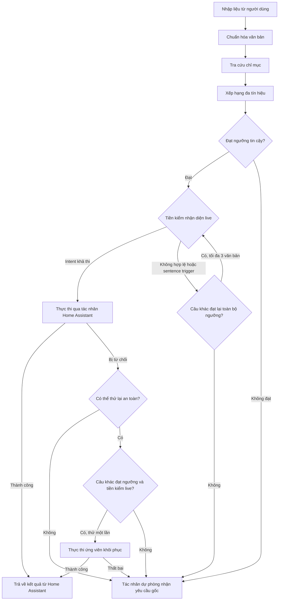

# Assist Canonicalizer cho Home Assistant

[](https://github.com/luuquangvu/assist-canonicalizer/releases)
[](https://github.com/hacs/integration)
[](https://www.home-assistant.io)

[](https://github.com/luuquangvu/assist-canonicalizer/actions/workflows/ci.yaml)
[](https://github.com/luuquangvu/assist-canonicalizer/actions/workflows/validation.yaml)
[](https://github.com/luuquangvu/assist-canonicalizer/actions/workflows/github-code-scanning/codeql)
[](https://github.com/luuquangvu/assist-canonicalizer/actions/workflows/prettier.yaml)

**[ [🇺🇸 English](README.md) | 🇻🇳 Tiếng Việt ]**

**Assist Canonicalizer** cải thiện khả năng nhận diện ý định của Home Assistant Assist bằng cách chuyển yêu cầu ngôn ngữ tự nhiên thành câu lệnh chuẩn hóa trước khi gửi tới tác nhân hội thoại mặc định. Bộ tích hợp hoạt động như một tác nhân hội thoại của Home Assistant và sử dụng cơ chế xếp hạng từ vựng đa tín hiệu ngay trên hệ thống của bạn. Quy trình chuẩn hóa chạy cục bộ, không cần LLM hay dịch vụ bên ngoài.

---

## Mục lục

- [Assist Canonicalizer cho Home Assistant](#assist-canonicalizer-cho-home-assistant)
  - [Mục lục](#mục-lục)
  - [Tính năng nổi bật](#tính-năng-nổi-bật)
  - [Cài đặt](#cài-đặt)
    - [Cách 1: Sử dụng HACS (Khuyên dùng)](#cách-1-sử-dụng-hacs-khuyên-dùng)
    - [Cách 2: Cài đặt thủ công](#cách-2-cài-đặt-thủ-công)
  - [Hướng dẫn thiết lập & Cấu hình](#hướng-dẫn-thiết-lập--cấu-hình)
  - [Nguyên lý hoạt động](#nguyên-lý-hoạt-động)
  - [Hiệu năng đo kiểm (Benchmark Performance)](#hiệu-năng-đo-kiểm-benchmark-performance)
  - [Các hành động trong Công cụ nhà phát triển](#các-hành-động-trong-công-cụ-nhà-phát-triển)
    - [Thử nghiệm so khớp (Test Match)](#thử-nghiệm-so-khớp-test-match)
    - [Xây dựng lại chỉ mục (Rebuild Index)](#xây-dựng-lại-chỉ-mục-rebuild-index)
    - [Xóa chỉ mục (Clear Index)](#xóa-chỉ-mục-clear-index)
    - [Chẩn đoán (Diagnostics)](#chẩn-đoán-diagnostics)
    - [Xuất danh sách ứng viên (Dump Candidates)](#xuất-danh-sách-ứng-viên-dump-candidates)
  - [Kiểm soát độ tin cậy & Chuyển tiếp dự phòng (Confidence Gates & Fallback)](#kiểm-soát-độ-tin-cậy--chuyển-tiếp-dự-phòng-confidence-gates--fallback)
  - [Khắc phục sự cố & Gỡ lỗi](#khắc-phục-sự-cố--gỡ-lỗi)
    - [Các sự cố thường gặp](#các-sự-cố-thường-gặp)
    - [Quy trình chẩn đoán lỗi](#quy-trình-chẩn-đoán-lỗi)
  - [Yêu cầu hệ thống](#yêu-cầu-hệ-thống)
  - [Chất lượng Mã nguồn & Bảo mật](#chất-lượng-mã-nguồn--bảo-mật)
  - [Đóng góp](#đóng-góp)
  - [Bản quyền](#bản-quyền)
  - [Hỗ trợ dự án](#hỗ-trợ-dự-án)

---

## Tính năng nổi bật

- **Tác nhân hội thoại của Home Assistant**: Tích hợp trực tiếp vào Assist như một tác nhân hội thoại. Bộ tích hợp chuẩn hóa yêu cầu đầu vào rồi chuyển câu lệnh đã chọn qua luồng hội thoại tiêu chuẩn của Home Assistant.
- **Bộ chấm điểm xếp hạng từ vựng đa tín hiệu (Multi-Signal Lexical Ranking Engine)**: Đánh giá và chấm điểm từng câu lệnh ứng viên (candidate) dựa trên sự kết hợp của 4 thuật toán bổ trợ: **so khớp mờ RapidFuzz**, **độ tương đồng n-gram Jaccard**, **truy xuất xác suất BM25**, và **so khớp hành động theo miền ý định (intent domain action matching)**. Cơ chế chấm điểm có trọng số này mang lại độ chính xác vượt trội so với việc chỉ sử dụng một thuật toán đơn lẻ.
- **Tự động xây dựng chỉ mục câu lệnh**: Tự động tạo và cập nhật cơ sở dữ liệu mẫu câu chuẩn hóa từ mọi nguồn hiện có: ý định (intent) mặc định của Home Assistant, các tệp YAML chứa mẫu câu tùy chỉnh, tên thực thể và bí danh (alias), sơ đồ phòng/tầng (area/floor) và các tham số (slot) mở rộng động. Mọi quá trình đều diễn ra tự động mà không cần cấu hình thủ công.
- **Tối ưu tốc độ tải bằng bộ nhớ đệm**: Lưu trữ chỉ mục câu lệnh đã chuẩn hóa trực tiếp vào phân lớp lưu trữ của Home Assistant. Nhờ vậy, hệ thống có thể bỏ qua bước phân tích cú pháp (parsing) mẫu câu ở các lần khởi động tiếp theo, tối ưu đáng kể thời gian tải.
- **Bộ lọc độ tin cậy linh hoạt**: Tinh chỉnh việc phê duyệt kết quả khớp qua các ngưỡng **Độ tin cậy tối thiểu (Minimum Match Confidence)** và **Khoảng cách độ tin cậy cơ sở (Base Confidence Margin)**. Kết quả khớp từ vựng chính xác và các chính sách dựa trên bằng chứng mạnh khác có thể giảm khoảng cách yêu cầu; nếu không có chính sách nới lỏng nào trước đó áp dụng, các hành động cạnh tranh, bao gồm hành động đối nghịch đã biết, phải đạt toàn bộ khoảng cách cấu hình.
- **Tiền kiểm nhận diện live & Khôi phục có giới hạn**: Xác minh xem câu lệnh chuẩn hóa có khả thi hay không thông qua bộ nhận diện intent mặc định của Home Assistant trước khi thực thi. Hệ thống kiểm tra tối đa ba ứng viên có điểm tin cậy cao trước khi chuyển sang dự phòng, đồng thời hỗ trợ một lần khôi phục nếu lệnh bị từ chối trước khi bộ xử lý intent hoạt động.
- **Bộ công cụ chẩn đoán chuyên sâu cho nhà phát triển**: Cung cấp 5 hành động (service actions) chuyên dụng bao gồm `test_match`, `rebuild_index`, `clear_index`, `diagnostics`, và `dump_candidates` giúp bạn dễ dàng theo dõi quá trình xếp hạng, kiểm tra dữ liệu chỉ mục và quản lý vòng đời bộ nhớ đệm ngay trên giao diện Home Assistant.
- **Phân tách cơ sở dữ liệu theo ngôn ngữ**: Quản lý độc lập chỉ mục câu lệnh cho từng ngôn ngữ khác nhau, hỗ trợ tự động nhận diện và ánh xạ theo các biến thể ngôn ngữ của Home Assistant.
- **Tối ưu hiệu năng & An toàn bộ nhớ**: Giới hạn nghiêm ngặt số lượng ứng viên cho mỗi lượt xếp hạng để tránh quá tải bộ nhớ, kết hợp với cơ chế truy xuất registry thưa tại thời điểm truy vấn. Chỉ mục nhờ đó luôn nhỏ gọn và nhanh chóng trong khi vẫn đảm bảo tên thực thể và bí danh động có thể tìm kiếm được đầy đủ.
- **Chuẩn hóa cục bộ**: Các bước chuẩn hóa, lập chỉ mục, xếp hạng và kiểm tra khả năng khôi phục đều chạy trong Home Assistant. Bản thân bộ tích hợp không gửi dữ liệu đo từ xa hoặc yêu cầu tới dịch vụ đám mây; việc xử lý bên ngoài, nếu có, phụ thuộc vào tác nhân dự phòng bạn chọn.

---

## Cài đặt

### Cách 1: Sử dụng HACS (Khuyên dùng)

[](https://my.home-assistant.io/redirect/hacs_repository/?owner=luuquangvu&repository=assist-canonicalizer&category=integration)

1. Mở **HACS** trong Home Assistant.
2. Tìm kiếm **Assist Canonicalizer**.
3. Nếu không tìm thấy, nhấp vào biểu tượng ba chấm ở góc trên cùng bên phải và chọn **Kho lưu trữ tùy chỉnh (Custom repositories)**.
4. Thêm `https://github.com/luuquangvu/assist-canonicalizer` với danh mục **Bộ tích hợp (Integration)**.
5. Tìm kiếm **Assist Canonicalizer** và nhấp vào **Tải xuống (Download)**.
6. Khởi động lại Home Assistant.

### Cách 2: Cài đặt thủ công

1. Tải bản phát hành mới nhất và giải nén các tệp tin.
2. Sao chép thư mục `custom_components/assist_canonicalizer` vào thư mục `config/custom_components/` của Home Assistant.
3. Khởi động lại Home Assistant.

---

## Hướng dẫn thiết lập & Cấu hình

1. Vào **Cài đặt (Settings)** > **Thiết bị & Dịch vụ (Devices & Services)**.
2. Chọn **Thêm tích hợp (Add Integration)** và tìm kiếm **Assist Canonicalizer**.
3. Chọn **Tác nhân hội thoại dự phòng (Fallback Conversation Agent)**. Khi Assist Canonicalizer không thể xử lý yêu cầu một cách an toàn, bộ tích hợp sẽ chuyển nguyên văn yêu cầu tới tác nhân này. Để tăng khả năng khôi phục, hãy chọn một tác nhân có cách diễn giải ngôn ngữ khác, chẳng hạn như tác nhân sử dụng LLM. Tác nhân mặc định của Home Assistant vẫn được hỗ trợ, nhưng có thể gặp lại chính hạn chế đã khiến yêu cầu chuyển sang dự phòng.
4. Cấu hình **Độ tin cậy tối thiểu (Minimum Match Confidence)**: Yêu cầu câu lệnh ứng viên phải đạt điểm số bằng hoặc cao hơn ngưỡng này trên cả 4 thuật toán xếp hạng mới được chấp nhận. Khuyên dùng giữ nguyên cấu hình mặc định ban đầu và sử dụng công cụ **Test Match** để theo dõi điểm số thực tế trước khi tùy biến.
5. Cấu hình **Khoảng cách độ tin cậy cơ sở (Base Confidence Margin)**: Xác định khoảng cách điểm số thông thường giữa kết quả khớp cao nhất và lựa chọn thay thế tốt thứ hai (thuộc intent khác), tránh thực thi nhầm khi câu lệnh mơ hồ. Kết quả khớp từ vựng chính xác và các chính sách dựa trên bằng chứng mạnh khác có thể giảm hoặc bỏ qua yêu cầu này trước khi hệ thống đánh giá cạnh tranh giữa các hành động. Nếu không có chính sách nới lỏng nào trước đó áp dụng, các hành động cạnh tranh, bao gồm hành động đối nghịch đã biết như bật so với tắt, phải đạt toàn bộ giá trị cấu hình.
6. Vào **Cài đặt (Settings)** > **Trợ lý giọng nói (Voice assistants)** và mở Assist pipeline của bạn. Tại mục **Tác nhân hội thoại (Conversation agents)**, chọn **Assist Canonicalizer** từ danh sách tác nhân.

> [!IMPORTANT]
> **Lưu ý quan trọng**: Assist Canonicalizer chỉ thực sự hoạt động sau khi được cấu hình và kích hoạt trong Assist pipeline của bạn.
>
> Hãy bắt đầu với các giá trị ngưỡng mặc định và điều chỉnh dần trong quá trình sử dụng. Nếu bộ chuẩn hóa chuyển tiếp dự phòng quá thường xuyên, hãy thử hạ thấp `min_confidence`. Nếu nó khớp sai intent, hãy tăng `min_confidence` và `min_margin`.

---

## Nguyên lý hoạt động

Khi bạn nói một câu lệnh (qua STT) hoặc nhập nội dung vào ô chat Assist, Assist Canonicalizer sẽ nhận yêu cầu và xử lý theo quy trình dưới đây:



1. **Chuẩn hóa văn bản (Text Normalization)**: Loại bỏ dấu câu, đưa văn bản về chữ thường, loại bỏ các khoảng trắng thừa và chuẩn hóa ký tự theo định dạng NFKC. Quy trình này được áp dụng đồng bộ cho cả câu lệnh đầu vào lẫn các mẫu câu ứng viên để đảm bảo tính nhất quán khi so sánh.

2. **Tra cứu chỉ mục (Index Lookup)**: Câu lệnh đã chuẩn hóa sẽ được tra cứu trong cơ sở dữ liệu mẫu câu đã được xây dựng sẵn cho ngôn ngữ hiện tại, bao gồm:
   - **Intent mặc định**: Toàn bộ câu lệnh cố định và mở rộng template từ cấu hình ngôn ngữ gốc của Home Assistant.
   - **Câu lệnh tùy chỉnh**: Định nghĩa trong các tệp YAML `custom_sentences/<lang>/`, intent script trong `configuration.yaml` hoặc các automation câu lệnh được tạo từ giao diện (UI).
   - **Thực thể (Entities)**: Tên và bí danh (alias) của các thực thể được chia sẻ (exposed entities).
   - **Khu vực & Tầng (Areas & Floors)**: Sơ đồ phòng và tầng trong ngôi nhà.

3. **Chấm điểm và xếp hạng (Multi-Signal Ranking)**: Từng mẫu câu phù hợp sẽ được đánh giá độc lập qua 4 tiêu chí trước khi tính điểm số tổng hợp cuối cùng:
   - **Độ tương đồng từ (Word Similarity)**: Đo lường độ khớp của các từ và thứ tự xuất hiện, hỗ trợ xử lý lỗi gõ sai chính tả hoặc tráo đổi vị trí từ.
   - **So khớp mẫu ký tự (Character Pattern Matching)**: Phân tích các phân đoạn ký tự (character n-grams) chồng chéo để nhận diện các từ có cách viết tương đồng.
   - **Độ liên quan từ khóa (Keyword Relevance)**: Thuật toán BM25 đánh giá mức độ quan trọng và tính đặc trưng của từng từ trong câu lệnh của bạn.
   - **Ngữ cảnh ý định (Intent Context)**: Ưu tiên các kết quả có loại ý định (ví dụ: bật đèn, điều chỉnh nhiệt độ) đồng nhất với các kết quả khớp tốt nhất, nhằm giảm thiểu sai lệch ngữ cảnh.

4. **Kiểm tra ngưỡng độ tin cậy (Confidence Gate)**: Đánh giá ứng viên đứng đầu dựa trên các ngưỡng bạn đã cấu hình:
   - **Ngưỡng độ tin cậy**: Điểm số cuối cùng của ứng viên phải vượt qua ngưỡng sàn `min_confidence`.
   - **Khoảng cách độ tin cậy**: Thông thường, ứng viên phải bỏ xa đối thủ có ý nghĩa tiếp theo (ở intent khác) ít nhất một khoảng `min_margin` đã cấu hình. Kết quả khớp từ vựng chính xác có thể bỏ qua khoảng cách này, còn các chính sách dựa trên bằng chứng mạnh khác có thể giảm nó trước khi hệ thống đánh giá cạnh tranh giữa các hành động. Nếu không có chính sách nào trước đó áp dụng, các hành động cạnh tranh, bao gồm các cặp đối nghịch đã biết như bật/tắt, mở/đóng và khóa/mở khóa, phải đạt toàn bộ khoảng cách cấu hình. Quyết định phê duyệt và khoảng cách hiệu dụng có thể xem chi tiết trong chẩn đoán.

5. **Tiền kiểm live, thực thi và khôi phục có giới hạn**: Khi ứng viên vượt qua vòng lọc độ tin cậy, hệ thống tiến hành quy trình xác thực và thực thi nhiều giai đoạn:
   - **Tiền kiểm nhận diện live**: Câu lệnh được chạy thử qua bộ nhận diện intent mặc định của Home Assistant để đảm bảo nó có thể thực thi được. Nếu không hợp lệ (ví dụ: tham chiếu đến khu vực hoặc thiết bị không tồn tại), ứng viên sẽ bị loại bỏ, và hệ thống đánh giá lại danh sách còn lại (thử tối đa ba phương án khác nhau). Nếu không có phương án nào khả thi, hệ thống sẽ chuyển tiếp sang tác nhân dự phòng.
   - **Thực thi trực tiếp**: Nếu tiền kiểm thành công, câu lệnh được gửi đến tác nhân hội thoại mặc định của Home Assistant (HassIL) để thực thi.
   - **Khôi phục sau thực thi**: Nếu câu lệnh bị từ chối trước khi bộ xử lý intent thực sự hoạt động (như trả về lỗi `no_intent_match`, hoặc `no_valid_targets` do không tìm thấy thực thể), hệ thống có thể thử khôi phục một lần. Hệ thống sẽ lọc bỏ các lệnh trùng lặp và thử ứng viên tốt tiếp theo đạt ngưỡng tin cậy. Các lỗi xảy ra bên trong bộ xử lý intent sẽ không kích hoạt khôi phục và sẽ chuyển tiếp sang dự phòng.

6. **Chuyển tiếp dự phòng (Fallback)**: Nếu không tìm được ứng viên đủ an toàn, không đủ điều kiện khôi phục hoặc quá trình thực thi thất bại, bộ tích hợp chuyển nguyên văn yêu cầu ban đầu tới tác nhân dự phòng đã cấu hình.

---

## Hiệu năng đo kiểm (Benchmark Performance)

Để đảm bảo độ tin cậy thực tế, bộ tích hợp được đo kiểm đầu-cuối trong một môi trường Home Assistant sạch bằng cách sử dụng toàn bộ các trường hợp thực tế trên 5 ngôn ngữ (DE, EN, FR, NL, VI). Mỗi câu truy vấn gốc được thực thi theo cặp: chạy trực tiếp qua luồng Assist mặc định (HassIL) trước, sau đó qua Assist Canonicalizer. Cả hai lượt chạy được đối chiếu với các câu lệnh chuẩn để đo lường chính xác tỷ lệ nhận diện đúng intent, tham số hành động và thực thể đích.

### Kết quả tổng quan

<!-- BENCHMARK_OVERALL_START -->

> Phiên bản phụ thuộc benchmark: `Python` 3.14.6, `homeassistant` 2026.7.3, `hassil` 3.8.0, `home-assistant-intents` 2026.6.24.

| Chế độ         | Canonicalizer | HassIL trực tiếp | Tăng điểm % | Khôi phục | Hồi quy | Nhận diện sai | Dự phòng | P50 ms | P95 ms |
| :------------- | ------------: | ---------------: | ----------: | --------: | ------: | ------------: | -------: | -----: | -----: |
| `managed_live` |     **88.8%** |            47.9% |       +40.9 |       250 |       5 |          1.3% |     9.8% |  117.9 |  377.4 |

<!-- BENCHMARK_OVERALL_END -->

> Mỗi câu truy vấn thử nghiệm được chạy song song: trực tiếp qua Assist mặc định và qua Assist Canonicalizer. Sự so sánh này đo lường trực tiếp mức tăng độ chính xác (tăng điểm), số lượt khôi phục thành công và số ca hồi quy.

### Chi tiết theo từng ngôn ngữ

<!-- BENCHMARK_LANGS_START -->

| Ngôn ngữ | Canonicalizer | HassIL trực tiếp | Tăng điểm % | Khôi phục | Hồi quy | Nhận diện sai | Dự phòng | P50 ms | P95 ms |
| :------- | ------------: | ---------------: | ----------: | --------: | ------: | ------------: | -------: | -----: | -----: |
| EN       |     **91.5%** |            52.7% |       +38.8 |        51 |       1 |          0.0% |     8.5% |   79.9 |  426.0 |
| DE       |     **90.2%** |            48.4% |       +41.8 |        52 |       1 |          0.8% |     9.0% |  176.1 |  371.9 |
| FR       |     **89.1%** |            50.4% |       +38.7 |        47 |       1 |          2.5% |     8.4% |  123.1 |  421.6 |
| NL       |     **87.6%** |            48.8% |       +38.8 |        51 |       1 |          0.8% |    11.6% |  103.4 |  332.2 |
| VI       |     **85.0%** |            37.0% |       +48.0 |        49 |       1 |          3.0% |    12.0% |  104.2 |  241.3 |

<!-- BENCHMARK_LANGS_END -->

> [!NOTE]
> Trong bài kiểm tra hiệu năng này, chúng ta giả định rằng khoảng một nửa số lần các ý định của chúng ta hoạt động với HassIL mặc định. Thực tế có thể khác do thói quen sử dụng của bạn.
>
> Kết quả độ chính xác mang tính xác định đối với fixture mẫu (gồm 3 tầng, 12 khu vực và 60 thực thể). Thời gian phản hồi (độ trễ) phụ thuộc vào phần cứng, do đó khi đánh giá hiệu năng nên so sánh các báo cáo managed-live trước/sau trên cùng một thiết bị.
>
> Các báo cáo chi tiết và tệp dữ liệu JSON thô được tạo trong thư mục `scratch/` và không được commit vào kho lưu trữ. Điều này giúp tránh các thay đổi (diff) tệp quá lớn trong pull request, vốn có thể tạo ra nhiều nhiễu trong quá trình review mã nguồn bởi AI và các lập trình viên khác.

Để tái tạo bài đo kiểm hiệu năng từ [`tests/real_world/`](tests/real_world/), chạy lệnh:

```bash
uv run tools/benchmark.py
```

Để biết thông tin chi tiết về fixture đo kiểm, so sánh baseline và định dạng báo cáo, vui lòng xem [`tools/ha_dev/README.md`](tools/ha_dev/README.md). Lưu ý rằng công cụ `tools/benchmark_offline.py` chỉ dành riêng cho chẩn đoán offline và micro-profiling, không được coi là bằng chứng độ chính xác trong production.

Các ngôn ngữ được xác thực theo hai cấp độ:

- **Ngôn ngữ có kiểm thử độ chính xác (Accuracy-Gated)**: Tiếng Đức, Anh, Pháp, Hà Lan và Việt Nam được đảm bảo độ chính xác nhờ bộ dữ liệu thử nghiệm thực tế (corpus) được duy trì liên tục.
- **Ngôn ngữ kiểm tra tương thích (Compatibility Smoke-Tested)**: Tất cả các ngôn ngữ khác được cung cấp bởi `home-assistant-intents` đều được kiểm tra tự động. Bài kiểm tra này đảm bảo chỉ mục của ngôn ngữ đó được tải chính xác, không phát sinh lỗi cú pháp và hoạt động ổn định trên môi trường chạy thực tế, mặc dù không cam kết về mặt chính xác ngữ nghĩa.

---

## Các hành động trong Công cụ nhà phát triển

Tất cả các hành động của bộ tích hợp đều có thể truy cập từ **Công cụ nhà phát triển** > **Hành động** (Developer Tools > Actions) trong Home Assistant.

### Thử nghiệm so khớp (Test Match)

**Hành động**: `assist_canonicalizer.test_match`

Chạy thử nghiệm toàn bộ luồng xử lý và trả về kết quả chấm điểm chi tiết của các ứng viên. Công cụ này rất hữu ích để phân tích lý do câu lệnh được chấp nhận hoặc bị chuyển tiếp dự phòng, từ đó điều chỉnh các ngưỡng lọc cho phù hợp.

| Trường     | Bắt buộc | Mô tả                                        |
| ---------- | -------- | -------------------------------------------- |
| `text`     | Có       | Câu lệnh đầu vào cần thử nghiệm              |
| `language` | Không    | Mã ngôn ngữ (tự động nhận diện nếu bỏ trống) |

**Kết quả trả về bao gồm**:

- `normalized_text`: Dạng câu lệnh sau khi chuẩn hóa.
- `top_candidates`: Danh sách ứng viên được xếp hạng, trong đó đối tượng `scores` chứa các khóa `rapidfuzz`, `char_ngram`, `bm25`, `intent`, `penalty` và `final`.
- `selected_candidate`: Câu lệnh được chọn và ý định (intent) tương ứng.
- `accepted`: Trạng thái duyệt (đã vượt qua các ngưỡng lọc hay chưa).

### Xây dựng lại chỉ mục (Rebuild Index)

**Hành động**: `assist_canonicalizer.rebuild_index`

Kích hoạt thủ công quá trình quét dữ liệu và xây dựng lại chỉ mục câu lệnh cho một ngôn ngữ nhất định. Hành động này tích hợp cơ chế chống trùng lặp (deduplicated): nếu tiến trình xây dựng chỉ mục đang chạy cho ngôn ngữ đó, yêu cầu mới sẽ được gộp chung và đợi tiến trình hiện tại hoàn thành.

| Trường     | Bắt buộc | Mô tả                                        |
| ---------- | -------- | -------------------------------------------- |
| `language` | Không    | Mã ngôn ngữ cần xây dựng lại dữ liệu chỉ mục |

### Xóa chỉ mục (Clear Index)

**Hành động**: `assist_canonicalizer.clear_index`

Xóa bộ nhớ đệm chỉ mục của một ngôn ngữ cụ thể (hoặc tất cả các ngôn ngữ nếu để trống). Hành động này cũng sẽ xóa sạch dữ liệu chỉ mục được lưu trữ trên đĩa cứng của Home Assistant.

| Trường     | Bắt buộc | Mô tả                             |
| ---------- | -------- | --------------------------------- |
| `language` | Không    | Mã ngôn ngữ cần xóa chỉ mục cache |

### Chẩn đoán (Diagnostics)

**Hành động**: `assist_canonicalizer.diagnostics`

Trả về thông tin trạng thái hoạt động theo thời gian thực của bộ tích hợp, bao gồm:

- `candidate_count`: Số lượng mẫu câu trong chỉ mục đang hoạt động.
- `index_version`: Phiên bản của chỉ mục hiện hành.
- `last_query_latency_ms`: Thời gian xử lý của câu lệnh gần nhất (ms).
- `last_fallback_reason`: Lý do câu lệnh gần nhất bị chuyển tiếp dự phòng.
- `last_error`: Lỗi gần nhất ghi nhận được.
- `dynamic_candidate_count`: Số lượng ứng viên được sinh ra tự động từ các thực thể hệ thống.
- `cached_languages`: Danh sách ngôn ngữ có dữ liệu chỉ mục lưu trên RAM.
- `cached_candidate_counts`: Số lượng ứng viên của từng ngôn ngữ trên RAM.
- `pending_rebuild_languages`: Các ngôn ngữ đang trong hàng đợi xây dựng lại chỉ mục.
- `registry_slot_counts`: Số lượng giá trị đăng ký theo từng thành phần (tên thực thể, phòng,...).
- `dynamic_candidate_generation`: Trạng thái và giới hạn tài nguyên của tiến trình mở rộng ứng viên động.
- `subscribed_intent_source_counts`: Số lượng intent đăng ký nhận dữ liệu từ các tác nhân khác.

### Xuất danh sách ứng viên (Dump Candidates)

**Hành động**: `assist_canonicalizer.dump_candidates`

Trích xuất thông tin chi tiết về cơ cấu chỉ mục của một ngôn ngữ, bao gồm số lượng câu từ các nguồn, thống kê theo intent, số lượng giá trị thực thể và danh sách mẫu câu cụ thể. Hữu ích để kiểm tra xem một câu lệnh đã được đưa vào cơ sở dữ liệu của bộ chuẩn hóa hay chưa.

| Trường     | Bắt buộc | Mô tả                                                                         |
| ---------- | -------- | ----------------------------------------------------------------------------- |
| `language` | Không    | Mã ngôn ngữ cần kiểm tra                                                      |
| `rebuild`  | Không    | Nếu là `true`, sẽ làm mới dữ liệu ứng viên trước khi xuất (mặc định: `false`) |

---

## Kiểm soát độ tin cậy & Chuyển tiếp dự phòng (Confidence Gates & Fallback)

Bộ tích hợp sử dụng hai ngưỡng cấu hình để quyết định có chấp nhận ứng viên đứng đầu hay không:

**Độ tin cậy tối thiểu (Minimum Match Confidence - `min_confidence`)**
: Điểm số tổng hợp có trọng số của ứng viên dẫn đầu phải lớn hơn hoặc bằng giá trị này. Điểm số dao động từ `0.0` (hoàn toàn không khớp) đến `1.0` (khớp tuyệt đối trên cả 4 thuật toán).

**Khoảng cách độ tin cậy cơ sở (Base Confidence Margin - `min_margin`)**
: Khoảng cách thông thường so với đối thủ có ý nghĩa tiếp theo. Các chính sách khớp từ vựng chính xác, điểm tin cậy cao và bằng chứng an toàn khác được đánh giá trước nên có thể giảm hoặc bỏ qua khoảng cách này ngay cả khi có cạnh tranh giữa các hành động. Nếu không có chính sách nới lỏng nào trước đó áp dụng, các hành động cạnh tranh, bao gồm hành động đối nghịch đã biết, phải đạt toàn bộ khoảng cách cấu hình. Chẩn đoán và **Test Match** hiển thị chính sách hiệu lực; metadata ứng viên không phải bảo đảm thực thi vì nhận diện live chỉ chạy trên luồng hội thoại production.

Khi câu lệnh bị **chuyển tiếp dự phòng (fallback)**, nguyên nhân cụ thể sẽ được lưu lại trong bảng chẩn đoán dưới các mã sau:

| Lý do                  | Ý nghĩa                                                                                                    |
| ---------------------- | ---------------------------------------------------------------------------------------------------------- |
| `low_confidence`       | Không có câu lệnh ứng viên nào đạt ngưỡng điểm `min_confidence`.                                           |
| `low_margin`           | Điểm số của ứng viên đứng đầu và ứng viên tiếp theo (intent khác) quá sát nhau (dưới ngưỡng `min_margin`). |
| `empty_index`          | Chỉ mục câu lệnh của ngôn ngữ hiện tại chưa được xây dựng.                                                 |
| `validation_failed`    | Lệnh không vượt qua tiền kiểm, hoặc cả lượt thực thi chính và khôi phục đều thất bại                       |
| `ranking_failed`       | Xảy ra lỗi xử lý trong bước chấm điểm và xếp hạng.                                                         |
| `unexpected_exception` | Gặp lỗi nghiêm trọng không xác định trong quá trình thực thi.                                              |

Bạn có thể kiểm tra lý do dự phòng của câu lệnh gần nhất bằng cách chạy hành động **Diagnostics**.

---

## Khắc phục sự cố & Gỡ lỗi

### Các sự cố thường gặp

**Bộ chuẩn hóa luôn chuyển sang dự phòng và không bao giờ so khớp thành công.**

1. Hãy sử dụng hành động **Diagnostics** để kiểm tra `last_fallback_reason`. Nếu lý do là `empty_index`, có nghĩa là chỉ mục chưa được tạo. Chỉ mục sẽ được chủ động làm nóng (warmup) ngay khi khởi động/tải lại cho tất cả ngôn ngữ được cấu hình trong Assist pipeline. Nếu `empty_index` vẫn xuất hiện, quá trình warmup có thể đã bị bỏ qua (không có pipeline nào được cấu hình, không có ngôn ngữ mặc định), hoặc quá trình xây dựng trong nền chưa hoàn tất. Bạn có thể kích hoạt thủ công qua hành động **Rebuild Index**.
2. Nếu lý do là `low_confidence`, ngưỡng `min_confidence` bạn đặt có thể quá cao. Hãy thử hạ thấp cấu hình này xuống. Bạn nên dùng công cụ **Test Match** để xem điểm số thực tế của các câu lệnh mẫu.
3. Nếu lý do là `validation_failed`, câu lệnh được chọn đã thất bại khi tiền kiểm, hoặc cả lượt thực thi chính lẫn khôi phục đều không thành công. Bạn hãy sử dụng công cụ **Test Match** để phân tích cách chấm điểm và **Dump Candidates** để kiểm tra các câu lệnh được đăng ký cho ngôn ngữ đó.

**Mẫu câu tùy chỉnh của tôi không được nhận diện.**

1. Kiểm tra lại cấu hình mẫu câu tùy chỉnh của bạn (nằm trong thư mục `config/custom_sentences/<lang>/`, intent script trong `configuration.yaml` hoặc automation từ giao diện). Đảm bảo mã ngôn ngữ được khai báo chính xác.
2. Chạy hành động **Dump Candidates** với tham số `rebuild: true` cho ngôn ngữ của bạn. Kiểm tra phần thống kê nguồn (`source` counts): nếu chỉ số `custom_sentence` bằng 0, có nghĩa là các tệp YAML của bạn chưa được Home Assistant tải lên thành công.
3. Chắc chắn các tệp YAML tuân thủ đúng [cú pháp mẫu câu của Home Assistant](https://www.home-assistant.io/voice_control/custom_sentences/).
4. Chạy hành động **Rebuild Index** để làm mới lại cơ sở dữ liệu sau khi sửa đổi các tệp cấu hình mẫu câu.

**Bộ tích hợp xử lý chậm ở câu lệnh đầu tiên.**

Chỉ mục cho các ngôn ngữ đã cấu hình trong Assist pipeline được xây dựng chủ động trong nền ngay khi khởi động và sau khi tải lại. Trong điều kiện bình thường, câu lệnh đầu tiên cho một ngôn ngữ sẽ truy cập vào bộ nhớ đệm đã sẵn sàng và không gặp độ trễ khởi tạo.

Nếu vẫn có độ trễ, chỉ mục có thể chưa hoàn tất quá trình xây dựng (kiểm tra `pending_rebuild_languages` trong kết quả **Diagnostics**). Các ngôn ngữ nằm ngoài cấu hình pipeline của bạn sẽ được xây dựng lười (lazy) ở lần sử dụng đầu tiên. Các lượt truy vấn tiếp theo sẽ sử dụng chỉ mục trong RAM nên tốc độ xử lý sẽ cực kỳ nhanh.

**Tôi mới cập nhật thực thể/khu vực/tầng nhưng bộ chuẩn hóa chưa nhận diện.**

Assist Canonicalizer tự động lắng nghe các sự kiện thay đổi từ sổ đăng ký thực thể, khu vực, tầng của Home Assistant và sẽ tự động xây dựng lại chỉ mục sau 5 giây (debounce). Nếu thay đổi chưa có hiệu lực ngay lập tức, hãy đợi một vài giây hoặc chạy hành động **Rebuild Index** để đồng bộ tức thì.

### Quy trình chẩn đoán lỗi

Để khắc phục sự cố một cách bài bản, hãy thực hiện theo các bước sau:

1. **Kiểm tra trạng thái chung**: Chạy hành động **Diagnostics** để xem tổng số mẫu câu trong chỉ mục, phiên bản dữ liệu hiện tại, độ trễ xử lý và lý do dự phòng của câu lệnh gần nhất.
2. **Kiểm tra cơ sở dữ liệu**: Chạy **Dump Candidates** với tùy chọn `rebuild: true` để xem chi tiết cơ cấu mẫu câu theo nguồn, mức độ phủ của các intent và danh sách các câu mẫu.
3. **Phân tích câu lệnh lỗi**: Chạy hành động **Test Match** với chính xác câu lệnh gặp sự cố. Quan sát đối tượng `scores` trong từng phần tử của mảng `top_candidates` (`rapidfuzz`, `char_ngram`, `bm25`, `intent`, `penalty`, `final`) cùng khóa `score` ở cấp cao nhất để hiểu rõ vì sao mẫu câu đó không vượt qua được các ngưỡng lọc.
4. **So sánh với tác nhân dự phòng**: Nếu câu lệnh bị chuyển dự phòng, hãy so sánh kết quả xử lý của bộ chuẩn hóa và tác nhân dự phòng qua công cụ **Test Match**. Nếu điểm số của ứng viên phù hợp chỉ thấp hơn ngưỡng cấu hình một chút, bạn có thể cân nhắc hạ nhẹ ngưỡng tin cậy. Nếu tác nhân dự phòng cũng xử lý kém, bạn cần bổ sung thêm mẫu câu phù hợp hơn trong tệp cấu hình.
5. **Tinh chỉnh các ngưỡng lọc**: Dựa trên điểm số phân tích từ **Test Match**, điều chỉnh các tham số `min_confidence` và `min_margin` trong phần cấu hình tích hợp, sau đó chạy lại **Test Match** để kiểm chứng.
6. **Xem nhật ký hệ thống (Logs)**: Tra cứu các dòng log của Home Assistant liên quan đến miền `assist_canonicalizer` để tìm kiếm thêm thông tin chi tiết lỗi.

---

## Yêu cầu hệ thống

- **Home Assistant** `>= 2024.12.0`
- Bộ tích hợp yêu cầu miền `conversation` và phụ thuộc vào sự sẵn có của thành phần `assist_pipeline`. Hoạt động tốt với mọi tác nhân hội thoại được Home Assistant hỗ trợ.

---

## Chất lượng Mã nguồn & Bảo mật

Để duy trì tiêu chuẩn cao về độ tin cậy và sự ổn định lâu dài, dự án áp dụng quy trình kiểm soát chất lượng và bảo mật tự động hiện đại:

- **Đánh giá mã nguồn tự động (PR Review)**: Sử dụng [CodeRabbit AI](https://coderabbit.ai) để phân tích chi tiết mọi thay đổi, giúp phát hiện sớm các lỗi logic và trường hợp biên trước khi phát hành.
- **Tối ưu hóa mã nguồn**: [Sourcery AI](https://sourcery.ai) liên tục rà soát mã nguồn để đề xuất các cấu trúc Python sạch, hiệu quả và chuẩn mực hơn.
- **Phân tích tĩnh & Bảo mật**: [CodeQL](https://codeql.github.com) thực hiện quét chuyên sâu để nhận diện các rủi ro bảo mật tiềm ẩn, đảm bảo mã nguồn tuân thủ các quy chuẩn an toàn.
- **Quy trình kiểm thử nghiêm ngặt**:
  - **[Ruff](https://github.com/astral-sh/ruff)**: Định dạng và kiểm tra lỗi (linting) Python tốc độ cao cho mã nguồn nhất quán.
  - **[Ty](https://github.com/astral-sh/ty)** & **[Pyright](https://github.com/Microsoft/pyright)**: Kiểm tra kiểu dữ liệu hai lớp để phát hiện lỗi trước khi chạy và duy trì sự ổn định của API.
  - **[Pytest](https://github.com/pytest-dev/pytest)**: Bộ kiểm thử tự động đảm bảo các tính năng luôn vận hành ổn định và không bị lỗi hồi quy (regression).
  - **[Interrogate](https://github.com/econchick/interrogate)**: Bắt buộc viết chú thích (docstring) đầy đủ cho tất cả các hàm và lớp để code luôn dễ đọc, dễ hiểu.
  - **[Prettier](https://github.com/prettier/prettier)**: Duy trì định dạng nhất quán cho các tệp tài liệu và cấu hình.

> [!NOTE]
> Mọi kết quả từ các công cụ tự động đều được quản trị viên dự án trực tiếp rà soát và xác nhận kỹ lưỡng, đảm bảo sự ổn định cao nhất cho người dùng.

---

## Đóng góp

Sự đóng góp từ cộng đồng là yếu tố cốt lõi giúp các dự án mã nguồn mở phát triển mạnh mẽ và sáng tạo hơn. Mọi đóng góp của bạn đều được **ghi nhận và trân trọng**.

> [!IMPORTANT]
> Môi trường phát triển cho dự án này là **Linux**. Nếu bạn sử dụng Windows, vui lòng cài đặt và sử dụng [WSL (Windows Subsystem for Linux)](https://learn.microsoft.com/vi-vn/windows/wsl/install), vì bộ công cụ phát triển và kiểm thử (test suite & development tools) được tối ưu hóa để chạy trên Linux.
>
> Các thư viện phụ thuộc và tiến trình thực thi của dự án được quản lý thông qua `uv`.

- **Nếu bạn tìm thấy lỗi**, hãy giúp dự án hoàn thiện hơn bằng cách [mở một issue](https://github.com/luuquangvu/assist-canonicalizer/issues).
- **Nếu bạn muốn đóng góp mã nguồn**, hãy fork kho lưu trữ và tạo Pull Request (đảm bảo mã nguồn của bạn đã vượt qua các [bước kiểm tra chất lượng](#chất-lượng-mã-nguồn--bảo-mật) phía trên).

---

## Bản quyền

Dự án được phát hành dưới **Giấy phép MIT**. Xem tệp [LICENSE](LICENSE) để biết thêm thông tin chi tiết.

## Hỗ trợ dự án

Nếu thấy dự án này hữu ích, sự ủng hộ của bạn là nguồn động lực lớn để mình tiếp tục hoàn thiện nó tốt hơn nữa. Cảm ơn bạn! ❤️

[](https://www.paypal.me/luuquangvu89)
