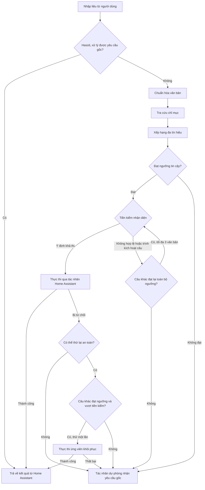

# Assist Canonicalizer cho Home Assistant

[](https://github.com/luuquangvu/assist-canonicalizer/releases)
[](https://github.com/hacs/integration)
[](https://www.home-assistant.io)

[](https://github.com/luuquangvu/assist-canonicalizer/actions/workflows/ci.yaml)
[](https://github.com/luuquangvu/assist-canonicalizer/actions/workflows/validation.yaml)
[](https://github.com/luuquangvu/assist-canonicalizer/actions/workflows/github-code-scanning/codeql)
[](https://github.com/luuquangvu/assist-canonicalizer/actions/workflows/prettier.yaml)

**[🇺🇸 English](README.md) | 🇻🇳 Tiếng Việt**

**Assist Canonicalizer** cải thiện khả năng nhận diện ý định (intent) của Home Assistant Assist bằng cách ánh xạ yêu cầu ngôn ngữ tự nhiên sang câu lệnh ý định chuẩn (canonical intent sentence) trước khi gửi tới tác nhân hội thoại mặc định. Bộ tích hợp hoạt động như một tác nhân hội thoại của Home Assistant và sử dụng cơ chế xếp hạng từ vựng đa tín hiệu (multi-signal lexical ranking) ngay trên hệ thống của bạn. Quy trình ánh xạ câu lệnh chuẩn (canonicalization) chạy cục bộ, không cần LLM hay dịch vụ bên ngoài.

Trong thực tế, cùng một yêu cầu có thể được diễn đạt theo nhiều cách. Thứ tự từ, từ đệm, bí danh hoặc lỗi chuyển giọng nói thành văn bản đều có thể ảnh hưởng đến kết quả. Assist Canonicalizer xử lý các biến thể này, còn Home Assistant vẫn đảm nhiệm bước nhận diện ý định và thực thi cuối cùng.

---

## Mục lục

- [Assist Canonicalizer cho Home Assistant](#assist-canonicalizer-cho-home-assistant)
  - [Mục lục](#mục-lục)
  - [Tính năng nổi bật](#tính-năng-nổi-bật)
  - [Cài đặt](#cài-đặt)
    - [Cách 1: Sử dụng HACS (Khuyến nghị)](#cách-1-sử-dụng-hacs-khuyến-nghị)
    - [Cách 2: Cài đặt thủ công](#cách-2-cài-đặt-thủ-công)
  - [Thiết lập và cấu hình](#thiết-lập-và-cấu-hình)
  - [Cách hoạt động](#cách-hoạt-động)
  - [Kết quả đo kiểm](#kết-quả-đo-kiểm)
  - [Các hành động trong Công cụ nhà phát triển](#các-hành-động-trong-công-cụ-nhà-phát-triển)
    - [Đặt tác nhân dự phòng](#đặt-tác-nhân-dự-phòng)
    - [Thử nghiệm so khớp](#thử-nghiệm-so-khớp)
    - [Xây dựng lại chỉ mục](#xây-dựng-lại-chỉ-mục)
    - [Xóa chỉ mục](#xóa-chỉ-mục)
    - [Chẩn đoán](#chẩn-đoán)
    - [Xuất danh sách ứng viên](#xuất-danh-sách-ứng-viên)
  - [Kiểm soát độ tin cậy và chuyển tiếp dự phòng](#kiểm-soát-độ-tin-cậy-và-chuyển-tiếp-dự-phòng)
  - [Khắc phục sự cố và gỡ lỗi](#khắc-phục-sự-cố-và-gỡ-lỗi)
    - [Các sự cố thường gặp](#các-sự-cố-thường-gặp)
    - [Quy trình chẩn đoán lỗi](#quy-trình-chẩn-đoán-lỗi)
  - [Yêu cầu hệ thống](#yêu-cầu-hệ-thống)
  - [Chất lượng mã nguồn và bảo mật](#chất-lượng-mã-nguồn-và-bảo-mật)
  - [Đóng góp](#đóng-góp)
  - [Giấy phép](#giấy-phép)
  - [Hỗ trợ dự án](#hỗ-trợ-dự-án)

---

## Tính năng nổi bật

- **Tác nhân hội thoại của Home Assistant**: Tích hợp trực tiếp vào Assist như một tác nhân hội thoại. Bộ tích hợp chuẩn hóa yêu cầu đầu vào rồi chuyển câu lệnh đã chọn qua luồng hội thoại tiêu chuẩn của Home Assistant.
- **Bộ xếp hạng từ vựng đa tín hiệu (Multi-Signal Lexical Ranking Engine)**: Chấm điểm ứng viên bằng bốn tín hiệu bổ trợ: **so khớp mờ RapidFuzz (RapidFuzz fuzzy matching)**, **độ tương đồng Jaccard cho n-gram ký tự (character n-gram Jaccard similarity)**, **truy xuất xác suất BM25 (BM25 probabilistic retrieval)** và **so khớp hành động theo ý định (intent action matching)**. Việc kết hợp các tín hiệu giúp kết quả xếp hạng ổn định hơn so với chỉ dựa vào một điểm số.
- **Tự động xây dựng chỉ mục ứng viên (Automatic Candidate Index Building)**: Tạo chỉ mục riêng cho từng ngôn ngữ từ các nguồn Home Assistant được hỗ trợ: ý định tích hợp sẵn, tệp YAML chứa mẫu câu tùy chỉnh, tên và bí danh thực thể, sổ đăng ký khu vực và tầng, cùng các giá trị tham số (slot) được mở rộng động.
- **Lưu ứng viên trên ổ đĩa (On-Disk Candidate Persistence)**: Lưu danh sách ứng viên chuẩn trong hệ thống lưu trữ của Home Assistant. Các lần xây dựng sau có thể dùng lại danh sách này thay vì phân tích lại toàn bộ mẫu câu và tệp YAML.
- **Bộ lọc độ tin cậy có thể cấu hình (Configurable Confidence Gates)**: Điều chỉnh việc chấp nhận kết quả qua hai ngưỡng **Độ tin cậy tối thiểu (Minimum Match Confidence)** và **Khoảng cách độ tin cậy cơ sở (Base Confidence Margin)**. Kết quả khớp từ vựng chính xác và các chính sách có bằng chứng mạnh khác có thể giảm khoảng cách yêu cầu. Nếu không có chính sách nới lỏng phù hợp, các hành động cạnh tranh, kể cả hành động đối nghịch đã biết, phải đạt mức chênh lệch đầy đủ theo cấu hình.
- **Tiền kiểm nhận diện theo trạng thái thực tế và khôi phục có giới hạn (Live Recognition Preflight and Bounded Recovery)**: Xác minh câu lệnh chuẩn bằng bộ nhận diện ý định tích hợp sẵn của Home Assistant trước khi thực thi. Hệ thống thử tối đa ba ứng viên có độ tin cậy cao trước khi chuyển sang dự phòng, đồng thời cho phép một lần khôi phục nếu lệnh bị từ chối trước khi bộ xử lý ý định chạy.
- **Hành động dành cho nhà phát triển**: Sáu hành động `set_fallback_agent`, `test_match`, `rebuild_index`, `clear_index`, `diagnostics` và `dump_candidates` cho phép thay đổi tuyến dự phòng, xem điểm xếp hạng, thông tin chỉ mục, dữ liệu chẩn đoán và quản lý vòng đời chỉ mục ngay trong bảng Hành động của Home Assistant.
- **Chỉ mục riêng theo ngôn ngữ**: Quản lý độc lập chỉ mục cho từng ngôn ngữ và tự động đối chiếu biến thể ngôn ngữ với danh sách Home Assistant hỗ trợ.
- **Sử dụng tài nguyên có giới hạn (Bounded Resource Use)**: Giới hạn số ứng viên theo ý định và theo lượt xếp hạng, kết hợp tra cứu thưa tại thời điểm truy vấn trên dữ liệu sổ đăng ký (sparse query-time registry lookup). Cách này giúp kiểm soát mức sử dụng bộ nhớ trong khi vẫn đưa tên và bí danh thực thể động vào quá trình so khớp.
- **Chuẩn hóa cục bộ**: Các bước chuẩn hóa, lập chỉ mục, xếp hạng và kiểm tra khả năng khôi phục đều chạy trong Home Assistant. Bản thân bộ tích hợp không gửi dữ liệu đo từ xa hoặc yêu cầu tới dịch vụ đám mây; việc xử lý bên ngoài, nếu có, phụ thuộc vào tác nhân dự phòng bạn chọn.

---

## Cài đặt

### Cách 1: Sử dụng HACS (Khuyến nghị)

[](https://my.home-assistant.io/redirect/hacs_repository/?owner=luuquangvu&repository=assist-canonicalizer&category=integration)

1. Mở **HACS** trong Home Assistant.
2. Tìm kiếm **Assist Canonicalizer**.
3. Nếu không tìm thấy, nhấp vào biểu tượng ba chấm ở góc trên cùng bên phải và chọn **Kho lưu trữ tùy chỉnh (Custom repositories)**.
4. Thêm `https://github.com/luuquangvu/assist-canonicalizer` với danh mục **Bộ tích hợp (Integration)**.
5. Tìm kiếm **Assist Canonicalizer** và nhấp vào **Tải xuống (Download)**.
6. Khởi động lại Home Assistant.

### Cách 2: Cài đặt thủ công

1. Tải bản phát hành mới nhất và giải nén các tệp.
2. Sao chép thư mục `custom_components/assist_canonicalizer` vào thư mục `config/custom_components/` của Home Assistant.
3. Khởi động lại Home Assistant.

---

## Thiết lập và cấu hình

1. Vào **Cài đặt (Settings)** > **Thiết bị & Dịch vụ (Devices & Services)**.
2. Chọn **Thêm tích hợp (Add Integration)** và tìm kiếm **Assist Canonicalizer**.
3. Chọn **Tác nhân hội thoại dự phòng (Fallback Conversation Agent)**. Khi Assist Canonicalizer không thể xử lý yêu cầu một cách an toàn, bộ tích hợp sẽ chuyển nguyên văn yêu cầu tới tác nhân này. Để tăng khả năng khôi phục, hãy chọn một tác nhân có cách diễn giải ngôn ngữ khác, chẳng hạn như tác nhân sử dụng LLM. Tác nhân mặc định của Home Assistant vẫn được hỗ trợ, nhưng có thể gặp lại chính hạn chế đã khiến yêu cầu chuyển sang dự phòng.
4. Cấu hình **Độ tin cậy tối thiểu (Minimum Match Confidence)**: Điểm tổng hợp có trọng số của ứng viên phải đạt ngưỡng này mới được chấp nhận. Bạn nên bắt đầu với giá trị mặc định và dùng **Test Match** để xem điểm thực tế trước khi điều chỉnh.
5. Cấu hình **Khoảng cách độ tin cậy cơ sở (Base Confidence Margin)**: Xác định mức chênh lệch điểm thông thường giữa kết quả cao nhất và lựa chọn phù hợp tiếp theo thuộc ý định khác, giúp tránh thực thi khi câu lệnh còn mơ hồ. Kết quả khớp từ vựng chính xác và các chính sách có bằng chứng mạnh khác có thể giảm hoặc bỏ qua yêu cầu này trước khi hệ thống đánh giá cạnh tranh giữa các hành động. Nếu không có chính sách nới lỏng phù hợp, các hành động cạnh tranh, kể cả cặp đối nghịch như bật và tắt, phải đạt mức chênh lệch đầy đủ theo cấu hình.
6. Vào **Cài đặt (Settings)** > **Trợ lý giọng nói (Voice assistants)** và mở pipeline Assist của bạn. Tại mục **Tác nhân hội thoại (Conversation agents)**, chọn **Assist Canonicalizer**.

> [!IMPORTANT]
> Assist Canonicalizer chỉ xử lý câu lệnh sau khi được cấu hình và chọn trong pipeline Assist đang hoạt động.
>
> Hãy bắt đầu với các ngưỡng mặc định và điều chỉnh dựa trên kết quả thực tế. Nếu bộ chuẩn hóa chuyển tiếp dự phòng quá thường xuyên, hãy thử hạ `min_confidence`. Nếu chọn sai ý định, hãy tăng `min_confidence` và `min_margin`.

---

## Cách hoạt động

Khi pipeline Assist bật `prefer_local_intents`, Home Assistant để tác nhân HassIL tích hợp sẵn thử xử lý yêu cầu trước. Khi tùy chọn này bị tắt, Assist Canonicalizer cung cấp shortcut ưu tiên HassIL tương đương. Quá trình chuẩn hóa chỉ bắt đầu khi HassIL không xử lý được văn bản gốc:



1. **Ưu tiên HassIL**: Khi bật `prefer_local_intents`, Home Assistant thử HassIL trước khi chuyển sang Assist Canonicalizer. Khi tắt tùy chọn này, pipeline chuyển thẳng đến Assist Canonicalizer và bộ tích hợp gửi nguyên văn yêu cầu đến HassIL dưới dạng shortcut. Bộ tích hợp bỏ qua shortcut khi Home Assistant đã thực hiện lượt nhận diện ý định cục bộ. Nếu HassIL xử lý thành công, kết quả được trả về ngay và các bước còn lại được bỏ qua.

2. **Chuẩn hóa văn bản (Text Normalization)**: Chuẩn hóa ký tự theo NFKC, chuyển chữ hoa thành chữ thường theo Unicode, loại bỏ dấu câu và thu gọn khoảng trắng. Quy trình giống nhau được áp dụng cho câu lệnh đầu vào và các câu ứng viên.

3. **Tra cứu chỉ mục (Index Lookup)**: Câu lệnh đã chuẩn hóa được tra cứu trong chỉ mục của ngôn ngữ hiện tại, bao gồm:
   - **Ý định tích hợp sẵn**: Các câu cố định và phần mở rộng mẫu câu có giới hạn từ cấu hình ngôn ngữ của Home Assistant.
   - **Câu lệnh tùy chỉnh**: Định nghĩa trong tệp YAML `custom_sentences/<lang>/`, tập lệnh ý định trong `configuration.yaml` hoặc tự động hóa câu lệnh được tạo từ giao diện.
   - **Thực thể**: Tên và bí danh của các thực thể được cung cấp cho Assist.
   - **Khu vực và tầng**: Tên và bí danh trong sổ đăng ký khu vực, tầng.

4. **Chấm điểm và xếp hạng đa tín hiệu (Multi-Signal Ranking)**: Mỗi ứng viên được đánh giá bằng bốn tín hiệu trước khi tính điểm tổng hợp:
   - **Độ tương đồng từ**: Đo mức khớp của từ và thứ tự xuất hiện, hỗ trợ lỗi chính tả hoặc thay đổi vị trí từ.
   - **So khớp mẫu ký tự**: So sánh các nhóm ba ký tự chồng lấn để nhận diện cách viết tương tự.
   - **Độ liên quan từ khóa**: BM25 đánh giá mức độ quan trọng và tính đặc trưng của từng từ trong câu lệnh.
   - **Ngữ cảnh ý định**: Ưu tiên ứng viên có loại ý định, chẳng hạn bật đèn hoặc đặt nhiệt độ, phù hợp với các kết quả hàng đầu.

5. **Kiểm tra độ tin cậy (Confidence Gate)**: Đánh giá ứng viên đứng đầu dựa trên các ngưỡng đã cấu hình:
   - **Ngưỡng độ tin cậy**: Điểm số cuối cùng của ứng viên phải vượt qua ngưỡng sàn `min_confidence`.
   - **Khoảng cách độ tin cậy**: Thông thường, ứng viên phải dẫn trước đối thủ phù hợp tiếp theo thuộc ý định khác ít nhất `min_margin`. Kết quả khớp từ vựng chính xác có thể bỏ qua khoảng cách này; các chính sách có bằng chứng mạnh khác có thể giảm yêu cầu trước khi đánh giá cạnh tranh giữa các hành động. Nếu không có chính sách phù hợp, các cặp đối nghịch đã biết như bật/tắt, mở/đóng và khóa/mở khóa phải đạt mức chênh lệch đầy đủ. Quyết định và khoảng cách thực tế được hiển thị trong dữ liệu chẩn đoán.

6. **Tiền kiểm, thực thi và khôi phục có giới hạn**: Khi ứng viên vượt qua bộ lọc độ tin cậy, hệ thống tiến hành quy trình xác thực và thực thi theo nhiều giai đoạn:
   - **Tiền kiểm nhận diện theo trạng thái thực tế (Live Recognition Preflight)**: Câu lệnh được kiểm tra bằng bộ nhận diện ý định tích hợp sẵn của Home Assistant để xác nhận có thể thực thi. Nếu không hợp lệ, chẳng hạn tham chiếu đến khu vực hoặc thiết bị không tồn tại, ứng viên sẽ bị loại và hệ thống đánh giá danh sách còn lại, tối đa ba câu khác nhau. Nếu không có phương án khả thi, yêu cầu được chuyển sang tác nhân dự phòng.
   - **Thực thi trực tiếp**: Nếu tiền kiểm thành công, câu lệnh được gửi đến tác nhân hội thoại mặc định của Home Assistant (HassIL) để thực thi.
   - **Khôi phục có giới hạn sau thực thi (Bounded Post-Execution Recovery)**: Nếu câu lệnh bị từ chối trước khi bộ xử lý ý định chạy, chẳng hạn trả về `no_intent_match` hoặc `no_valid_targets` do không tìm thấy thực thể, hệ thống có thể khôi phục một lần. Hệ thống loại các lệnh trùng lặp và thử ứng viên phù hợp tiếp theo vẫn đạt ngưỡng tin cậy. Lỗi phát sinh bên trong bộ xử lý ý định không kích hoạt khôi phục và yêu cầu sẽ được chuyển sang dự phòng.

7. **Chuyển tiếp dự phòng (Fallback)**: Nếu không tìm được ứng viên đủ an toàn, không đủ điều kiện khôi phục hoặc quá trình thực thi thất bại, bộ tích hợp chuyển nguyên văn yêu cầu ban đầu tới tác nhân dự phòng đã cấu hình.

---

## Kết quả đo kiểm

Benchmark `managed_live` chạy mỗi truy vấn hai lần trên cùng một môi trường Home Assistant: một lần trực tiếp qua HassIL và một lần qua đường dẫn trực tiếp của Assist Canonicalizer. Để phản ánh đúng thứ tự xử lý thực tế, kết quả Assist Canonicalizer được tính theo kết quả HassIL khi HassIL xử lý chính xác; chỉ khi HassIL thất bại mới dùng kết quả của đường dẫn chuẩn hóa. Cách tính này mô phỏng cả hai đường dẫn ưu tiên HassIL: lượt nhận diện ý định cục bộ của Home Assistant khi bật `prefer_local_intents` và shortcut của Assist Canonicalizer khi tắt tùy chọn này. Cả hai lượt chạy đều được đối chiếu với dữ liệu kiểm soát có thể thực thi để đánh giá ý định, tham số và mục tiêu.

### Kết quả tổng quan

<!-- BENCHMARK_OVERALL_START -->

> Phiên bản phụ thuộc benchmark: `Python` 3.14.6, `homeassistant` 2026.7.4, `hassil` 3.8.0, `home-assistant-intents` 2026.6.24.

| Chế độ         | Assist Canonicalizer | HassIL trực tiếp | Tăng điểm % | Khôi phục | Ngăn hồi quy | Nhận diện sai | Dự phòng | P50 ms | P95 ms |
| :------------- | -------------------: | ---------------: | ----------: | --------: | -----------: | ------------: | -------: | -----: | -----: |
| `managed_live` |            **90.0%** |            47.9% |       +42.1 |       252 |            5 |          1.2% |     8.8% |   98.6 |  293.4 |

<!-- BENCHMARK_OVERALL_END -->

> Độ chính xác, nhận diện sai và dự phòng là ba kết quả loại trừ lẫn nhau của luồng ưu tiên HassIL; tổng các tỷ lệ là 100% trước khi làm tròn. “Ngăn hồi quy” là số truy vấn được HassIL xử lý chính xác trong khi đường dẫn chuẩn hóa trực tiếp không đạt tiêu chí đánh giá. Độ trễ được đo từ lượt chạy trực tiếp qua Assist Canonicalizer; báo cáo thô vẫn cung cấp riêng các chỉ số của đường dẫn này.

### Chi tiết theo từng ngôn ngữ

<!-- BENCHMARK_LANGS_START -->

| Ngôn ngữ | Assist Canonicalizer | HassIL trực tiếp | Tăng điểm % | Khôi phục | Ngăn hồi quy | Nhận diện sai | Dự phòng | P50 ms | P95 ms |
| :------- | -------------------: | ---------------: | ----------: | --------: | -----------: | ------------: | -------: | -----: | -----: |
| EN       |            **92.2%** |            52.7% |       +39.5 |        51 |            1 |          0.0% |     7.8% |   67.2 |  295.0 |
| DE       |            **91.0%** |            48.4% |       +42.6 |        52 |            1 |          0.8% |     8.2% |  151.9 |  308.7 |
| FR       |            **89.9%** |            50.4% |       +39.5 |        47 |            1 |          2.5% |     7.6% |   99.6 |  316.1 |
| NL       |            **89.9%** |            48.8% |       +41.1 |        53 |            1 |          0.8% |     9.3% |   91.7 |  271.7 |
| VI       |            **86.0%** |            37.0% |       +49.0 |        49 |            1 |          2.0% |    12.0% |   77.0 |  227.5 |

<!-- BENCHMARK_LANGS_END -->

> [!NOTE]
> Bộ dữ liệu được chủ ý xây dựng với tỷ lệ gần cân bằng giữa các trường hợp phù hợp với HassIL trực tiếp (khớp chính xác, ý định tích hợp sẵn và từ đệm được hỗ trợ) và các trường hợp thử thách mà HassIL trực tiếp được kỳ vọng không nhận diện (câu bị biến đổi, thiếu hoặc thừa từ, lỗi chính tả, thử thách ngữ nghĩa và cách diễn đạt tương đương). Thành phần này là lý do kết quả HassIL trực tiếp ở mức khoảng 50% trong bài đo kiểm được theo dõi. Đây là đặc điểm thiết kế của bộ dữ liệu, không phải tỷ lệ thành công dự kiến cho mọi hệ thống Home Assistant.
>
> Kết quả độ chính xác có thể tái tạo với môi trường kiểm thử cố định (fixture) gồm 3 tầng, 12 khu vực và 60 thực thể được cung cấp cho Assist. Độ trễ phụ thuộc vào phần cứng; nên so sánh báo cáo `managed_live` trước và sau thay đổi trên cùng một máy.
>
> Báo cáo chi tiết và dữ liệu JSON thô được tạo trong `scratch/` và không được đưa vào kho mã nguồn. Việc tách dữ liệu sinh tự động giúp pull request gọn và dễ xem xét hơn.

Để tái tạo bài đo kiểm hiệu năng từ [`tests/real_world/`](tests/real_world/), chạy lệnh:

```bash
uv sync --all-groups
uv run tools/benchmark.py
```

Để tìm hiểu môi trường kiểm thử được quản lý, cách so sánh đường cơ sở và định dạng báo cáo, xem [`tools/ha_dev/README.md`](tools/ha_dev/README.md). Công cụ `tools/benchmark_offline.py` dành cho chẩn đoán ngoại tuyến và đo kiểm tập trung; kết quả của công cụ này không đại diện cho độ chính xác khi vận hành thực tế.

Các ngôn ngữ được xác thực theo hai cấp độ:

- **Ngôn ngữ được đánh giá độ chính xác (Accuracy-Gated)**: Tiếng Đức, Anh, Pháp, Hà Lan và Việt Nam được đánh giá bằng bộ dữ liệu thực tế được duy trì trong kho mã nguồn.
- **Ngôn ngữ được kiểm tra tương thích (Compatibility Smoke-Tested)**: Các ngôn ngữ khác do `home-assistant-intents` cung cấp đều trải qua kiểm tra tự động để xác nhận chỉ mục có thể tải và xử lý mẫu câu mà không gặp lỗi. Kiểm tra này không đánh giá độ chính xác ngữ nghĩa.

---

## Các hành động trong Công cụ nhà phát triển

Tất cả các hành động của bộ tích hợp đều có thể truy cập từ **Công cụ nhà phát triển** > **Hành động** (Developer Tools > Actions) trong Home Assistant.

Khi kết quả không như mong đợi, các hành động này cho biết câu lệnh đã được chuẩn hóa và xếp hạng ra sao, chỉ mục hiện có gì và vì sao hệ thống chuyển sang dự phòng. Nhờ đó, bạn có thể xác định bước xảy ra vấn đề thay vì phải phỏng đoán.

### Đặt tác nhân dự phòng

**Hành động**: `assist_canonicalizer.set_fallback_agent`

Thay đổi tác nhân hội thoại dự phòng cho các yêu cầu tiếp theo. Lựa chọn này được lưu vào tùy chọn của bộ tích hợp và có hiệu lực ngay mà không cần tải lại, phù hợp với các tự động hóa chuyển đổi tác nhân theo điều kiện hiện tại.

| Trường     | Bắt buộc | Mô tả                                     |
| ---------- | -------- | ----------------------------------------- |
| `agent_id` | Có       | Tác nhân hội thoại được dùng làm dự phòng |

Phản hồi tùy chọn cho biết `fallback_agent_id`, `previous_fallback_agent_id` và `changed`. Giá trị `changed` là `true` khi Home Assistant đã cập nhật mục cấu hình được lưu, hoặc `false` khi mục đó đã giống hệt.

### Thử nghiệm so khớp

**Hành động**: `assist_canonicalizer.test_match`

Chạy bước xếp hạng từ vựng cho văn bản đầu vào và trả về điểm số cùng bằng chứng của bộ lọc độ tin cậy. Hành động này hỗ trợ kiểm tra kết quả so khớp và điều chỉnh ngưỡng; nó không chạy bước nhận diện ý định theo trạng thái thực tế của Home Assistant.

| Trường     | Bắt buộc | Mô tả                                                       |
| ---------- | -------- | ----------------------------------------------------------- |
| `text`     | Có       | Câu lệnh đầu vào cần thử nghiệm                             |
| `language` | Không    | Mã ngôn ngữ (dùng ngôn ngữ của Home Assistant nếu để trống) |

**Kết quả trả về bao gồm**:

- `normalized_text`: Dạng câu lệnh sau khi chuẩn hóa.
- `candidate_count`: Số ứng viên tĩnh trong chỉ mục ngôn ngữ.
- `dynamic_candidate_count`: Số ứng viên động (dynamic candidates) được tạo từ dữ liệu sổ đăng ký cho yêu cầu này.
- `evaluation`: Phạm vi đánh giá và thông tin cho biết hành động này không chạy bước nhận diện ý định theo trạng thái thực tế của Home Assistant.
- `top_candidates`: Danh sách ứng viên được xếp hạng, kèm dữ liệu tham số (slot), giá trị thay thế cho tham số ký tự đại diện (wildcard slot) và đối tượng `scores` chứa các khóa `rapidfuzz`, `char_ngram`, `bm25`, `intent`, `penalty` và `final`.
- `selected_candidate`: Ứng viên vượt qua các ngưỡng tin cậy, nếu có.
- `accepted`: Cho biết có ứng viên nào vượt qua các ngưỡng tin cậy hay không.
- `confidence_gate`: Các ngưỡng, chính sách chênh lệch điểm, bằng chứng về ứng viên cạnh tranh và lý do từ chối.

### Xây dựng lại chỉ mục

**Hành động**: `assist_canonicalizer.rebuild_index`

Kích hoạt thủ công quá trình quét dữ liệu và xây dựng lại chỉ mục câu lệnh cho một ngôn ngữ. Nếu đã có một lượt xây dựng lại đang chạy cho cùng ngôn ngữ, yêu cầu mới sẽ dùng chung lượt đó và chờ kết quả thay vì khởi chạy thêm một lượt.

| Trường     | Bắt buộc | Mô tả                                        |
| ---------- | -------- | -------------------------------------------- |
| `language` | Không    | Mã ngôn ngữ cần xây dựng lại dữ liệu chỉ mục |

**Phản hồi** bao gồm `language` đã chuẩn hóa, `candidate_count` của ngôn ngữ sau khi xây dựng và thời gian thực hiện trong `rebuild_latency_ms`.

### Xóa chỉ mục

**Hành động**: `assist_canonicalizer.clear_index`

Xóa chỉ mục trong bộ nhớ đệm của một ngôn ngữ cụ thể, hoặc của tất cả ngôn ngữ nếu để trống. Hành động này cũng xóa dữ liệu chỉ mục tương ứng trong kho lưu trữ của Home Assistant.

| Trường     | Bắt buộc | Mô tả                          |
| ---------- | -------- | ------------------------------ |
| `language` | Không    | Mã ngôn ngữ có chỉ mục cần xóa |

**Phản hồi** bao gồm mã `language` đã chuẩn hóa, `scope`, các ngôn ngữ đã xóa khỏi bộ nhớ đệm, số lượng ứng viên đã xóa và trạng thái bộ nhớ đệm còn lại.

### Chẩn đoán

**Hành động**: `assist_canonicalizer.diagnostics`

Trả về thông tin trạng thái hoạt động theo thời gian thực của bộ tích hợp, bao gồm:

- `total_cached_candidate_count`: Tổng số ứng viên trong tất cả chỉ mục ngôn ngữ đang lưu trong bộ nhớ.
- `cached_indexes`: Số ứng viên và phiên bản chỉ mục của từng ngôn ngữ đang lưu trong bộ nhớ.
- `last_query_latency_ms`: Thời gian xử lý của câu lệnh gần nhất (ms).
- `last_fallback_reason`: Lý do câu lệnh gần nhất bị chuyển tiếp dự phòng.
- `last_error`: Lỗi gần nhất ghi nhận được.
- `dynamic_candidate_count`: Số ứng viên động được tạo từ dữ liệu sổ đăng ký cho yêu cầu gần nhất.
- `pending_rebuild_languages`: Các ngôn ngữ đang trong hàng đợi xây dựng lại chỉ mục.
- `registry_slot_counts`: Số giá trị từ sổ đăng ký có sẵn cho từng loại slot, chẳng hạn như tên thực thể hoặc khu vực.
- `dynamic_candidate_generation`: Trạng thái và giới hạn của quá trình tạo ứng viên động.
- `subscribed_intent_source_counts`: Số ý định theo từng nguồn tác nhân hội thoại đã đăng ký.

### Xuất danh sách ứng viên

**Hành động**: `assist_canonicalizer.dump_candidates`

Trả về thông tin chi tiết về nhóm ứng viên của một ngôn ngữ, bao gồm thống kê theo nguồn và ý định, số lượng giá trị từ sổ đăng ký và một phần danh sách ứng viên. Hành động này hữu ích khi cần kiểm tra vì sao một câu lệnh có hoặc không xuất hiện trong chỉ mục.

| Trường     | Bắt buộc | Mô tả                                                                                     |
| ---------- | -------- | ----------------------------------------------------------------------------------------- |
| `language` | Không    | Mã ngôn ngữ cần kiểm tra                                                                  |
| `rebuild`  | Không    | Nếu là `true`, bắt buộc xây dựng lại chỉ mục trước khi trả về dữ liệu (mặc định: `false`) |

Phản hồi có cùng cấu trúc cho mọi giá trị `index_status`: `missing`, `cached` hoặc `rebuilt`. Nội dung bao gồm thời gian xây dựng lại, thống kê theo ý định và nguồn ứng viên, số lượng giá trị từ sổ đăng ký cho từng slot và một phần danh sách ứng viên. `candidate_sample.truncated` cho biết danh sách này đã được rút gọn và chỉ mục vẫn còn các ứng viên khác.

---

## Kiểm soát độ tin cậy và chuyển tiếp dự phòng

Bộ tích hợp sử dụng hai ngưỡng cấu hình để quyết định có chấp nhận ứng viên đứng đầu hay không:

**Độ tin cậy tối thiểu (Minimum Match Confidence - `min_confidence`)**: Điểm tổng hợp có trọng số của ứng viên dẫn đầu phải lớn hơn hoặc bằng giá trị này. Điểm dao động từ `0.0` (không khớp) đến `1.0` (điểm tổng hợp tối đa).

**Khoảng cách độ tin cậy cơ sở (Base Confidence Margin - `min_margin`)**: Mức chênh lệch thông thường so với ứng viên cạnh tranh phù hợp tiếp theo. Các chính sách khớp từ vựng chính xác, điểm tin cậy cao và bằng chứng an toàn khác được đánh giá trước nên có thể giảm hoặc bỏ qua yêu cầu này ngay cả khi có cạnh tranh giữa các hành động. Nếu không có chính sách nới lỏng phù hợp, các hành động cạnh tranh, kể cả hành động đối nghịch đã biết, phải đạt đầy đủ mức chênh lệch đã cấu hình. **Diagnostics** và **Test Match** hiển thị chính sách đang áp dụng; dữ liệu ứng viên không bảo đảm lệnh sẽ thực thi, vì bước nhận diện theo trạng thái thực tế chỉ chạy trong luồng hội thoại Assist thông thường.

Khi câu lệnh bị **chuyển tiếp dự phòng (fallback)**, nguyên nhân cụ thể sẽ được lưu lại trong bảng chẩn đoán dưới các mã sau:

| Lý do                  | Ý nghĩa                                                                                              |
| ---------------------- | ---------------------------------------------------------------------------------------------------- |
| `low_confidence`       | Không có câu lệnh ứng viên nào đạt ngưỡng điểm `min_confidence`.                                     |
| `low_margin`           | Điểm của ứng viên đứng đầu và ứng viên tiếp theo thuộc ý định khác quá sát nhau (dưới `min_margin`). |
| `empty_index`          | Chỉ mục câu lệnh của ngôn ngữ hiện tại chưa được xây dựng.                                           |
| `validation_failed`    | Lệnh không vượt qua tiền kiểm, hoặc cả lượt thực thi chính và khôi phục đều thất bại.                |
| `ranking_failed`       | Xảy ra lỗi xử lý trong bước chấm điểm và xếp hạng.                                                   |
| `unexpected_exception` | Gặp lỗi nghiêm trọng không xác định trong quá trình thực thi.                                        |

Bạn có thể kiểm tra lý do dự phòng của câu lệnh gần nhất bằng cách chạy hành động **Diagnostics**.

---

## Khắc phục sự cố và gỡ lỗi

Trước khi điều chỉnh ngưỡng, hãy kiểm tra trạng thái hoạt động và các ứng viên hiện có, sau đó xem bằng chứng xếp hạng cho đúng câu lệnh gặp lỗi. Cách này giúp tránh cải thiện một câu lệnh nhưng lại làm giảm độ tin cậy của câu khác.

### Các sự cố thường gặp

**Bộ chuẩn hóa luôn chuyển sang dự phòng và không bao giờ so khớp thành công.**

1. Dùng **Diagnostics** để kiểm tra `last_fallback_reason`. `empty_index` cho biết chỉ mục chưa được tạo. Khi khởi động hoặc tải lại, bộ tích hợp xây dựng trước chỉ mục cho các ngôn ngữ đã cấu hình trong Assist pipeline. Nếu `empty_index` vẫn xuất hiện, có thể không có pipeline hoặc ngôn ngữ mặc định phù hợp, hoặc quá trình xây dựng nền chưa hoàn tất. Bạn có thể chạy **Rebuild Index** theo cách thủ công.
2. Nếu lý do là `low_confidence`, ngưỡng `min_confidence` bạn đặt có thể quá cao. Hãy thử hạ thấp cấu hình này xuống. Bạn nên dùng công cụ **Test Match** để xem điểm số thực tế của các câu lệnh mẫu.
3. Nếu lý do là `validation_failed`, câu lệnh được chọn đã thất bại khi tiền kiểm, hoặc cả lượt thực thi chính lẫn khôi phục đều không thành công. Bạn hãy sử dụng công cụ **Test Match** để phân tích cách chấm điểm và **Dump Candidates** để kiểm tra các câu lệnh được đăng ký cho ngôn ngữ đó.

**Mẫu câu tùy chỉnh của tôi không được nhận diện.**

1. Kiểm tra cấu hình mẫu câu tùy chỉnh trong `config/custom_sentences/<lang>/`, tập lệnh ý định trong `configuration.yaml` hoặc tự động hóa từ giao diện. Đảm bảo mã ngôn ngữ được khai báo đúng.
2. Chạy **Dump Candidates** với `rebuild: true` cho ngôn ngữ cần kiểm tra. Xem `candidate_source_counts`: nếu `custom_sentence` bằng 0 hoặc không xuất hiện, các tệp YAML có thể chưa được tải.
3. Chắc chắn các tệp YAML tuân thủ đúng [cú pháp mẫu câu của Home Assistant](https://www.home-assistant.io/voice_control/custom_sentences/).
4. Chạy hành động **Rebuild Index** để làm mới lại cơ sở dữ liệu sau khi sửa đổi các tệp cấu hình mẫu câu.

**Bộ tích hợp xử lý chậm ở câu lệnh đầu tiên.**

Chỉ mục cho các ngôn ngữ đã cấu hình trong Assist pipeline được xây dựng trước ở chế độ nền khi khởi động và sau khi tải lại. Trong điều kiện bình thường, câu lệnh đầu tiên sẽ dùng chỉ mục đã sẵn sàng trong bộ nhớ đệm.

Nếu vẫn có độ trễ, chỉ mục có thể chưa xây dựng xong; hãy kiểm tra `pending_rebuild_languages` trong kết quả **Diagnostics**. Chỉ mục cho ngôn ngữ chưa có trong cấu hình pipeline được tạo ở lần sử dụng đầu tiên. Các lượt truy vấn sau sẽ dùng chỉ mục trong bộ nhớ.

**Tôi mới cập nhật thực thể/khu vực/tầng nhưng bộ chuẩn hóa chưa nhận diện.**

Assist Canonicalizer theo dõi thay đổi trong sổ đăng ký thực thể, khu vực và tầng của Home Assistant. Các thay đổi liên tiếp được gộp trong khoảng 5 giây trước khi chỉ mục được xây dựng lại. Nếu dữ liệu chưa cập nhật, hãy đợi vài giây hoặc chạy **Rebuild Index**.

### Quy trình chẩn đoán lỗi

Để khắc phục sự cố một cách bài bản, hãy thực hiện theo các bước sau:

1. **Kiểm tra trạng thái chung**: Chạy **Diagnostics** và xem `cached_indexes`, `last_query_latency_ms` cùng `last_fallback_reason`.
2. **Kiểm tra chỉ mục**: Chạy **Dump Candidates** với `rebuild: true` để xem thống kê theo nguồn, mức độ phủ của ý định và phần mẫu ứng viên có giới hạn.
3. **Phân tích câu lệnh lỗi**: Chạy **Test Match** với đúng câu lệnh gặp sự cố. Xem đối tượng `scores` trong từng phần tử `top_candidates` (`rapidfuzz`, `char_ngram`, `bm25`, `intent`, `penalty` và `final`) cùng `confidence_gate`.
4. **Kiểm tra việc chuyển tiếp dự phòng**: Nếu bộ chuẩn hóa chuyển yêu cầu sang tác nhân dự phòng, dùng **Test Match** để xem quyết định xếp hạng, sau đó xem dấu vết Assist (Assist trace) hoặc nhật ký để biết kết quả của tác nhân dự phòng. Ứng viên phù hợp nhưng chỉ thấp hơn ngưỡng một chút có thể là cơ sở để điều chỉnh cẩn trọng; nếu cả hai luồng đều cho kết quả kém, nguồn ý định có thể chưa bao phủ câu lệnh.
5. **Tinh chỉnh các ngưỡng lọc**: Dựa trên điểm số phân tích từ **Test Match**, điều chỉnh các tham số `min_confidence` và `min_margin` trong phần cấu hình tích hợp, sau đó chạy lại **Test Match** để kiểm chứng.
6. **Xem nhật ký hệ thống**: Tra cứu các dòng nhật ký Home Assistant liên quan đến miền `assist_canonicalizer`.

---

## Yêu cầu hệ thống

- **Home Assistant** `>= 2024.12.0`
- Bộ tích hợp yêu cầu miền `conversation` và thành phần `assist_pipeline`. Có thể dùng với các tác nhân hội thoại được Home Assistant hỗ trợ.

---

## Chất lượng mã nguồn và bảo mật

Vì câu lệnh giọng nói có thể điều khiển thiết bị thật, mỗi thay đổi cần được kiểm tra không chỉ ở trường hợp thành công mà cả cách xử lý lỗi và thông tin chẩn đoán. Dự án kết hợp công cụ tự động với việc xem xét mã nguồn để phát hiện lỗi hồi quy, hành vi không an toàn và những giả định không còn đúng với phần triển khai hiện tại.

- **Quy trình xác thực**: Lệnh xác thực chung của kho mã nguồn kiểm tra tính nhất quán của các thư viện phụ thuộc, định dạng, quy tắc mã nguồn (lint), kiểu dữ liệu, độ bao phủ của docstring và hành vi:
  - **[Ruff](https://github.com/astral-sh/ruff)**: Định dạng và kiểm tra mã nguồn Python.
  - **[Ty](https://github.com/astral-sh/ty)** và **[Pyright](https://github.com/Microsoft/pyright)**: Hai công cụ kiểm tra kiểu tĩnh (static type checking) bổ trợ cho nhau.
  - **[Pytest](https://github.com/pytest-dev/pytest)**: Kiểm thử hành vi và lỗi hồi quy (regression testing).
  - **[Interrogate](https://github.com/econchick/interrogate)**: Kiểm tra mức độ bao phủ của docstring (docstring coverage).
  - **[Prettier](https://github.com/prettier/prettier)**: Duy trì định dạng nhất quán cho các tệp tài liệu và cấu hình.
- **Phân tích tĩnh và bảo mật (Static Analysis and Security)**: [CodeQL](https://codeql.github.com) quét kho mã nguồn để tìm các mẫu lỗ hổng mà công cụ hỗ trợ phát hiện.
- **Hỗ trợ xem xét mã nguồn**: [CodeRabbit AI](https://coderabbit.ai) và [Sourcery AI](https://sourcery.ai) cung cấp thêm đề xuất. Mỗi phát hiện được đối chiếu với mã nguồn hiện tại trước khi chấp nhận thay đổi.

Trước khi mở pull request, hãy chạy cùng lệnh xác thực được dùng trong kho mã nguồn:

```bash
uv run tools/validate.py
```

> [!NOTE]
> Việc các công cụ báo thành công là bằng chứng hữu ích, nhưng không thay thế cho việc hiểu luồng mã nguồn bị ảnh hưởng. Các đề xuất tự động chỉ mang tính tham khảo; mỗi cách sửa vẫn phải được kiểm tra với mã nguồn hiện tại.

---

## Đóng góp

Mọi đóng góp, dù nhỏ, đều được hoan nghênh. Một câu lệnh giúp tái hiện lỗi trong một ngôn ngữ, một đoạn hướng dẫn dễ hiểu hơn hoặc một kiểm thử hồi quy đúng trọng tâm đều có thể hữu ích không kém một thay đổi mã nguồn.

Những hình thức đóng góp đặc biệt hữu ích gồm:

- **Báo cáo lỗi hữu ích**: Cung cấp phiên bản Home Assistant và bộ tích hợp, ngôn ngữ, nguyên văn câu lệnh, kết quả mong đợi, kết quả thực tế và thông tin chẩn đoán liên quan. Hãy xóa tên thực thể riêng tư hoặc thông tin về ngôi nhà trước khi chia sẻ.
- **Hỗ trợ ngôn ngữ**: Chia sẻ cách diễn đạt tự nhiên, bí danh và trường hợp biên từ quá trình sử dụng thực tế. Thay đổi cho bộ dữ liệu kiểm thử đa ngôn ngữ sẽ hữu ích hơn khi có ý định, tham số và câu lệnh chuẩn mong đợi.
- **Tài liệu và trải nghiệm sử dụng**: Cải thiện hướng dẫn thiết lập, khắc phục sự cố hoặc bản dịch nếu có nội dung khó tìm hay khó hiểu.
- **Mã nguồn và kiểm thử**: Giữ thay đổi tập trung, giải thích hành vi cần sửa và bổ sung kiểm thử hồi quy khi phù hợp.

> [!IMPORTANT]
> Môi trường phát triển của dự án là **Linux**. Nếu dùng Windows, hãy cài đặt [WSL (Windows Subsystem for Linux)](https://learn.microsoft.com/vi-vn/windows/wsl/install), vì bộ kiểm thử và công cụ phát triển được thiết kế để chạy trên Linux.
>
> Các thư viện phụ thuộc và tiến trình thực thi của dự án được quản lý thông qua `uv`.

Nếu bạn phát hiện lỗi hoặc muốn trao đổi về một thay đổi trong cách hoạt động, hãy bắt đầu bằng cách [mở issue](https://github.com/luuquangvu/assist-canonicalizer/issues). Nếu muốn đóng góp mã nguồn, hãy fork kho lưu trữ, mở pull request với phạm vi rõ ràng và đảm bảo thay đổi vượt qua các [bước kiểm tra chất lượng](#chất-lượng-mã-nguồn-và-bảo-mật).

---

## Giấy phép

Dự án được phát hành dưới **Giấy phép MIT**. Xem tệp [LICENSE](LICENSE) để biết thêm thông tin chi tiết.

---

## Hỗ trợ dự án

Bạn có thể hỗ trợ dự án bằng cách sử dụng bộ tích hợp, báo cáo rõ ràng các trường hợp biên, bổ sung cách diễn đạt cho các ngôn ngữ hoặc chia sẻ dự án với những người dùng Home Assistant khác. Phản hồi từ thực tế giúp phát hiện những nhu cầu mà dữ liệu kiểm thử có thể bỏ sót.

Nếu muốn hỗ trợ thêm chi phí duy trì, bạn cũng có thể đóng góp tài chính, nhưng điều này hoàn toàn không bắt buộc. Cảm ơn bạn đã sử dụng và đóng góp cho dự án. ❤️

[](https://www.paypal.me/luuquangvu89)
